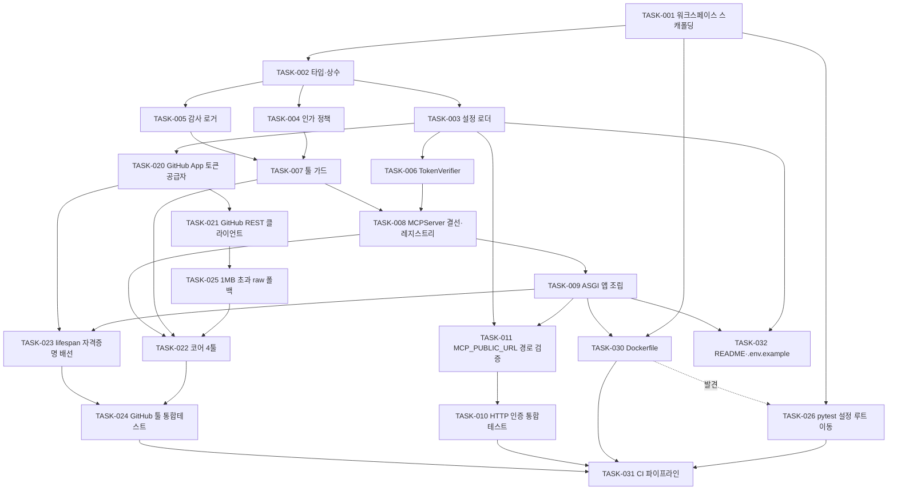

# Plan — Management MCP 서버 부트스트랩 (Stage 1)

> `FRD.md`의 요구사항을 실행 가능한 Task로 분해.
> 규칙: 단일·검증가능·증분적 / 파일 경로 명시 / 의존성 없으면 `[P]` / `traces`로 역추적 / 테스트 먼저.

## 1. Approach

- **요약:** 공식 MCP Python SDK **v2(`mcp` 2.1.1)** 의 `MCPServer` + `streamable_http_app()`으로 서버를 세우고, 인증(`TokenVerifier`)·인가(순수 함수 정책)·감사(툴 래퍼)를 GitHub 어댑터보다 **먼저** 완성한다. 그 위에 GitHub App 자격증명 → REST 클라이언트 → 코어 4툴을 얹고, 마지막에 컨테이너·CI로 감싼다. 바닥(타입·설정)부터 위(툴)로 쌓아 각 단계가 독립적으로 검증되게 한다.
- **PR 분리:** **3개로 분리한다.** 근거는 두 개의 뚜렷한 경계다 — ① **위험·블로킹 축**: PR2는 사용자만 만들 수 있는 GitHub App(`RES-API-005`, FRD §6.4에서 "미생성")에 막힐 수 있고 PR1은 그것 없이 완결 검증되므로, 한 PR로 묶으면 외부 작업 대기가 전체를 정지시킨다. ② **리뷰 관점 축**: PR3(Dockerfile·CI)은 애플리케이션 코드가 아니라 배포 인프라라 리뷰자·검증 수단이 다르고(로컬 Docker 미설치 → CI에서만 검증, FRD §7), 의존성 그래프의 자연 절단면과도 일치한다. PR 간 의존은 PR1 → PR2 → PR3 단방향이다.

## 2. Resource Check (착수 전)

- [x] 기존 참고 코드 없음 확인 — 저장소 추적 파일 0개, `Initial commit`(95e6e6b) 하나 (FRD §6.1)
- [x] MCP SDK v2 계약 확인 — `MCPServer`·`TokenVerifier`/`AuthSettings` 동반 필수·`transport_security` Host allowlist·middleware provisional (FRD §6.2)
- [x] 로컬 툴체인 — Python 3.14.2, uv 0.11.4
- [ ] **`GITHUB_APP_*` 자격증명 3종 — 사용자 작업, 그러나 PR2 구현의 하드 블로커는 아니다**: GitHub App 생성 → `org-devoks` 설치 → App ID·private key(PEM)·installation ID 확보 (`RES-API-005`). PR2의 코드·단위·통합 테스트는 **테스트용 임시 RSA 키 + GitHub HTTP mock**으로 전량 검증되므로 자격증명 없이 완결된다. 실제 자격증명이 필요한 것은 **실 GitHub 대상 라이브 호출 1회 확인**뿐이며, 이는 Stage 2 배포 검증 항목으로 미룬다(FRD §10).
- [ ] `MCP_REPO_ALLOWLIST` 로컬 검증 초기값 확정 — 기본 후보 `ridsync/devoks-mcp-servers` (`CTR-008`)
- [ ] Docker 미설치 확인됨 → PR3의 이미지 빌드·기동 검증은 CI에서 수행 (FRD §7)

## 3. Tasks

> 형식: `- [ ] TASK-ID [P?] 설명 — size: <S|M|L> — test: <required|skip> — file: <경로> — traces: <ID>`
> 경로는 별도 표기 없으면 `servers/management/src/devoks_mcp_management/` 기준.

### PR1 — 프로젝트 부트스트랩 + 서버 골격 (Auth · RBAC · Audit)

- [x] `TASK-001` uv workspace 모노레포 스캐폴딩 + 툴체인 설정 (루트 workspace members, 서버 패키지 의존성 `mcp==2.1.1`, ruff·pyright 설정, `.gitignore`, `.python-version`) — size: M — test: skip — file: `pyproject.toml`, `servers/management/pyproject.toml`, `.gitignore`, `.python-version` — traces: DSN-008 ✓(`uv sync` exit 0 / `from mcp.server import MCPServer` 실측 확인 / ruff·pyright exit 0)
- [x] `TASK-002` 도메인 타입·상수 정의 (감사 레코드 스키마, 툴 이름 상수, 응답 상한·검색 개수·토큰 갱신 여유 기본값) — size: S — test: skip — file: `types.py` — traces: CTR-003, CTR-004, CTR-005, CTR-009 ✓(ruff/format exit 0, pyright strict `0 errors`, frozen·import 스모크 통과 / 메인 루프 직접 구현)
- [x] `TASK-003` 설정 로더 — 환경변수 → 불변 Settings, 기동 시 전량 검증(누락 키 명시·PEM 파싱 검증), 토큰 테이블 파싱 — size: M — test: required — file: `config.py` — traces: AC-001-5, AC-002-6, AC-006-4, CTR-006, EDGE-002, EDGE-008, DSN-006 ✓(`uv run pytest` exit 0 `29 passed in 1.90s` / ruff·pyright exit 0 / `tests/test_config.py` 29케이스, 시크릿 repr 미노출 단정 포함. FRD §5.2에 누락 env 키 3개 확정 기록)
- [x] `TASK-004` [P] 인가 정책 순수 함수 — 역할↔툴 판정, repo allowlist 완전일치 판정, 빈 allowlist는 전부 거부, 거부 응답에 목록·존재여부 미노출 — size: M — test: required — file: `auth/policy.py` — traces: AC-003-1, AC-003-2, AC-003-3, AC-003-4, AC-003-5, CTR-007, CTR-008, EDGE-001, DSN-002 ✓(`uv run pytest` exit 0 `58 passed` / ruff·pyright exit 0 / `tests/test_policy.py` 29케이스. 거부 2층 분리 — 클라이언트는 고정 문자열 1개, 감사는 `ReasonCode`. `CTR-003`에 `reason_code` 필드 추가로 착지점 확정)
- [x] `TASK-005` [P] 감사 로거 — `CTR-003` 필드 구조화 JSON 1줄 stdout emit + 토큰·PEM·파일본문 마스킹 — size: M — test: required — file: `audit/logger.py` — traces: AC-004-1, AC-004-3, CTR-003, DSN-003 ✓(`uv run pytest` exit 0 `77 passed` / ruff·pyright exit 0 / `tests/test_audit_logger.py` 19케이스. `to_json_line` 순수 함수 + `emit(record, *, stream)` 분리, 마스킹은 절단 **이전**에 검사)
- [x] `TASK-006` TokenVerifier 구현 — 정적 토큰 테이블 조회, `AccessToken`(client_id·role·scopes) 반환, 미등록 토큰은 `None` — size: M — test: required — file: `auth/verifier.py` — traces: AC-002-1, AC-002-6, CTR-002, DSN-001 ✓(`uv run pytest` exit 0 `90 passed` / ruff·pyright exit 0 / `tests/test_verifier.py` 13케이스. **`AccessToken`에 `role` 없음 실측** → `claims["role"]` + `get_role()` 접근자, SDK `get_access_token()` 동일객체 왕복 독립 검증. 토큰 비교는 `secrets.compare_digest` 전순회)
- [x] `TASK-007` 툴 가드 데코레이터 — 인가 판정 선행 → 거부 시 툴 본문 미실행, 예외 정규화(스택트레이스 비노출), 성공·거부·오류 전부 감사 emit — size: M — test: required — file: `tools/guard.py` — traces: AC-003-2, AC-004-2, AC-004-4, EDGE-009, DSN-003 ✓(`uv run pytest` exit 0 `107 passed` / ruff·pyright exit 0 / `tests/test_guard.py` 17케이스. `make_tool_guard(settings, *, emit, clock, ...)` 팩토리 → `guard(tool, *, repo_arg, audit_args)`. 신원 없음=fail-safe deny(`no_identity`). **독립 검증**: 거부 2종의 클라이언트 메시지 동일·본문 미실행·파일본문 감사 미유출)
- [x] `TASK-008` MCPServer 결선 + 툴 레지스트리 — `token_verifier=`·`auth=AuthSettings(...)` 동반 주입, `required_scopes` 설정, 계층별 어댑터 툴 수집 — size: M — test: required — file: `server.py`, `tools/registry.py` — traces: AC-001-2, AC-002-5, CTR-001, CTR-007, EDGE-010, DSN-005 ✓(`uv run pytest` exit 0 `121 passed` / ruff·pyright exit 0 / `tests/test_server.py` 10 + `tests/test_registry.py` 4케이스. **실측 반영**: 스코프 부족은 403 `insufficient_scope`(401 아님) → FRD `AC-002-5`·`EDGE-010` 정밀화. `AuthSettings` URL은 plain str 전달(AnyHttpUrl 래핑 시 후행 슬래시 부착) → FRD §7 추가)
- [x] `TASK-009` ASGI 앱 조립 — Starlette(`/healthz` + `Mount /mcp`), `transport_security` 환경변수 주입, lifespan 골격 — size: M — test: required — file: `app.py` — traces: AC-001-1, AC-001-3, AC-001-4, AC-002-3, AC-002-4, CTR-001, CTR-006, EDGE-011, DSN-007 ✓(`uv run pytest` exit 0 `136 passed` / ruff·pyright exit 0 / `tests/test_app.py` 15케이스. **독립 검증**: 라우트 3개 이중화 없음, 421/403/401/403-insufficient_scope 전부 실측 일치, well-known `resource`가 `MCP_PUBLIC_URL`과 정확히 일치. 진입점 `uvicorn devoks_mcp_management.app:create_app_from_env --factory`)
- [x] `TASK-011` `MCP_PUBLIC_URL` 경로 검증 (Fail-Fast) — 경로 컴포넌트가 비어 있거나 후행 슬래시가 있으면 기동 실패. SDK가 well-known 경로를 이 path에서 파생하므로 오설정 시 `CTR-001` 경로가 조용히 깨진다(`TASK-009` 실측 발견) — size: M — test: required — file: `config.py` — traces: CTR-001, CTR-006, AC-002-4, DSN-006 ✓(`uv run pytest` exit 0 `143 passed` / ruff·pyright exit 0 / `tests/test_config.py` +7케이스. **독립 검증**: 6개 URL 형태 전부 규칙대로, 리버스 프록시 접두 통과, 오류 모아 보고 유지)
- [x] `TASK-010` HTTP 계층 **인증 성공 경로 + 스코프 거부 + RFC 9728 문서 전량** 통합 테스트 — `TASK-009`의 `test_app.py`가 이미 덮은 401/421/403(Origin)/well-known `resource`는 **중복 작성하지 않고**, 유효 토큰으로 `initialize`→`tools/list`가 실제로 성공하는 인증 성공 경로, 403 `insufficient_scope`, RFC 9728 문서의 `authorization_servers`·`scopes_supported`·`bearer_methods_supported` 전량, 미들웨어 순서(토큰 없이 미허용 Host → 421 아닌 401)를 검증한다 — size: M — test: required — file: `servers/management/tests/test_http_auth.py` — traces: AC-001-1, AC-002-1, AC-002-2, AC-002-3, AC-002-4, AC-002-5, AC-001-4, EDGE-010, EDGE-011 ✓(`uv run pytest` exit 0 `147 passed` / ruff·pyright exit 0 / `tests/test_http_auth.py` 4케이스. **독립 검증**: 유효 토큰으로 `initialize`→`tools/list` HTTP 왕복 성공. **부수 발견**: 협상 프로토콜이 `2025-11-25`(세션 발급) → FRD §7·§10에 legacy 레그 확장 결정 기록)

> **PR1 완료** — `TASK-001`~`TASK-011` 11개 전부 `[x]`. 테스트 147개 통과.

### PR2 — GitHub Knowledge 어댑터 + 코어 4툴

- [x] `TASK-020` [P] GitHub App installation 토큰 공급자 — App JWT 서명 → 토큰 교환, 캐시·만료 여유 기반 갱신, 동시 갱신 1회 합치기 — size: M — test: required — file: `adapters/knowledge/github/credentials.py` — traces: AC-006-1, AC-006-2, AC-006-3, AC-006-5, CTR-009, EDGE-007, RES-API-001, DSN-004 ✓(`uv run pytest` exit 0 `164 passed` / ruff·pyright exit 0 / `tests/test_credentials.py` 17케이스. **독립 검증**: 동시 10개→발급 1회·전부 동일 토큰, 실패 후 재시도 가능, 시크릿 미유출, `aclose`가 주입 클라이언트를 닫지 않음. **메인 루프 수정 1건**: 에이전트가 웹 도구 없이 학습 지식으로 작성한 JWT 클레임을 공식 문서와 대조 → `exp`를 `now+600`(창 660s, 상한 정확히 접촉)에서 `iat+600`(창 600s, 미래 540s)으로 교체)
- [x] `TASK-021` GitHub REST 클라이언트 — 호출 래핑, 4xx/5xx·rate limit(재시도 시각 포함)·미존재 오류 정규화, `CTR-004` 절단 + 전체 크기 통지, UTF-8 실패 시 바이너리 판정 — size: M — test: required — file: `adapters/knowledge/github/client.py` — traces: AC-005-4, AC-005-5, AC-005-7, AC-005-8, AC-005-9, CTR-004, EDGE-003, EDGE-004, EDGE-005, EDGE-006, RES-API-002, RES-API-003, RES-API-004 ✓(`uv run pytest` exit 0 `196 passed` / ruff·pyright exit 0 / `tests/test_github_client.py` 32케이스. **메인 루프 공식문서 대조**: `text-match` Accept·rate limit 403/429+헤더 판정은 정확. 1MB 초과 파일 처리는 `AC-005-4` 미충족 → `TASK-025`로 분리)
- [x] `TASK-025` 1 MB 초과 파일 raw 미디어타입 폴백 — GitHub contents API는 1–100 MB 파일의 내용을 기본 JSON에 싣지 않는다(공식 문서). 현재 `unavailable`로 반환하나 `AC-005-4`는 "상한까지 절단해 반환"을 요구한다. raw 미디어타입으로 받아 `CTR-004` 상한까지 절단하고, >100 MB는 조회 불가를 크기와 함께 알린다 — size: M — test: required — file: `adapters/knowledge/github/client.py` — traces: AC-005-4, CTR-004, EDGE-004, EDGE-012, RES-API-003 ✓(`uv run pytest` exit 0 `203 passed` / ruff·pyright exit 0 / `tests/test_github_client.py` 32→39케이스. **독립 검증**: ≤1MB는 HTTP 1회 유지(폴백이 정상경로 미오염), 1–100MB는 raw Accept로 2회 후 절단, >100MB는 raw 미발송, 멀티바이트 절단 백오프 정상. `status`는 4값 유지하고 `unavailable` 의미를 >100MB로 축소)
- [x] `TASK-022` 코어 4툴 정의·등록 — `list_repos`(allowlist만) / `get_repo_tree` / `read_file` / `search_code`(`CTR-005` 상한), 각 툴에 가드 적용 — size: M — test: required — file: `adapters/knowledge/github/tools.py` — traces: AC-005-1, AC-005-2, AC-005-3, AC-005-6, CTR-005, CTR-007, CTR-008 ✓(`uv run pytest` exit 0 `217 passed` / ruff·pyright exit 0 / `tests/test_github_tools_wiring.py` 14케이스. **독립 검증**: 4툴 전부 실제 `input_schema`(`repo*`/`path*`/`ref`/`query*`) 노출·`ctx` 숨김·output schema 생성·`search_code` 설명에 분당 10회 제약 포함. 가드 래핑은 `functools.wraps`의 `__wrapped__` 체인을 SDK가 따라가 스키마 보존 — `guard.py` 수정 불필요)
- [x] `TASK-023` lifespan 자격증명 배선 — 토큰 공급자·HTTP 클라이언트를 기동 시 1회 구성해 툴에 주입, 종료 시 정리 — size: M — test: required — file: `app.py`, `server.py` — traces: AC-006-1, DSN-004 ✓(`uv run pytest` exit 0 `224 passed` / ruff·pyright exit 0 / `tests/test_github_lifespan.py` 7케이스. **독립 검증(전 구간 실동작)**: lifespan 진입 시 GitHub 호출 0회(lazy), `list_repos`가 allowlist 교집합만 반환, `read_file`이 `complete`로 내용 반환, allowlist 밖 요청은 GitHub 미호출 상태로 `denied`, 감사 JSON이 stdout에 실제 출력. HTTP 타임아웃 30초 명시(`httpx2` 기본 5초는 페이지네이션·raw 폴백에 타이트))
- [x] `TASK-024` GitHub 툴 **풀스택** 통합 테스트 — `TASK-022`는 mock `GitHubClient`로 툴 계약을, `TASK-023`은 실제 조립으로 `list_repos`만 덮었다. 이 Task는 **실제 `GitHubClient`+토큰 공급자를 통과해 HTTP 경계에서만 mock**하는 경로로 `get_repo_tree`·`read_file`·`search_code`를 검증하고, GitHub 엣지 케이스(rate limit·절단·바이너리·404)가 **MCP 툴 응답까지 올바르게 전달**되는지, 빈 allowlist에서 전부 거부되는지를 확인한다 — size: M — test: required — file: `servers/management/tests/test_github_tools.py` — traces: AC-005-2, AC-005-3, AC-005-6, AC-005-7, AC-005-8, AC-005-9, AC-003-3, EDGE-001, EDGE-003, EDGE-004, EDGE-005 ✓(`uv run pytest` exit 0 `235 passed` / ruff·pyright exit 0 / `tests/test_github_tools.py` 11케이스. **프로덕션 버그 0건** — 층 연결 지점 정보 유실 없음, 빈/불일치 allowlist에서 3툴 모두 GitHub 호출 0회. 단 `list_repos`는 `repo_arg` 게이팅 대상이 아니라 조회 후 필터링으로 fail-safe 달성)

> **PR2 완료** — `TASK-020`·`021`·`025`·`022`·`023`·`024` 6개 전부 `[x]`. 테스트 235개 통과. GitHub 코어 4툴이 실제 자격증명 경로를 통과해 동작.

### PR3 — 컨테이너화 · CI · 인수인계 문서

- [x] `TASK-026` pytest 설정을 워크스페이스 루트로 이동 — `[tool.pytest.ini_options]`가 멤버 패키지에만 있어 루트에서 `uv run pytest`가 `asyncio_mode`를 못 찾고 **129 failed / 106 passed**로 오보고했다(`TASK-030` 발견, 독립 재현). ruff·pyright처럼 루트로 올려 SSOT화 — size: S — test: skip — file: `pyproject.toml`, `servers/management/pyproject.toml` — traces: DSN-008 ✓(메인 루프 직접. **4가지 호출 방식 전부 `235 passed`** 확인: 루트 인자없음/루트 경로명시/멤버디렉토리/멤버+tests. ruff·pyright 회귀 없음. CI가 특별한 주문 없이 `uv run pytest`만 써도 정상 동작)
- [x] `TASK-030` Dockerfile — 멀티스테이지(uv 기반 의존성 설치 → 런타임), 비루트 사용자 실행, 시크릿 미포함, `CTR-010` 타깃 아키텍처 — size: M — test: skip — file: `servers/management/Dockerfile`, `.dockerignore` — traces: AC-007-1, AC-007-4, AC-007-5, CTR-010 ✓(멀티스테이지 `python:3.14-slim-trixie`, `USER 10001:10001`, exec-form CMD + `$MCP_PORT` 확장, `PYTHONUNBUFFERED=1`. **`.dockerignore`는 빌드 컨텍스트 루트에 배치**(Docker가 Dockerfile 위치가 아닌 컨텍스트 루트에서 찾음). 검증: `uv sync --frozen --no-dev` 2레이어 재현 exit 0, 진입점 해석 확인, 베이스 이미지 arm64+amd64 존재 실측, `.env` 실제 생성해 컨텍스트 배제 확인, `hadolint` 0 findings, 235 passed. **미검증(Docker 미설치)**: `docker build`·`docker run`·헬스체크 실동작 → `TASK-031`)
- [x] `TASK-031` GitHub Actions CI — lint·타입 검사·테스트·이미지 빌드 + 컨테이너 기동 후 헬스 200 스모크, 하나라도 실패 시 파이프라인 실패 — size: M — test: skip — file: `.github/workflows/ci.yml` — traces: AC-007-2, AC-007-3 ✓(2잡 병렬 — `quality`(ubuntu-latest) + `docker`(**네이티브 `ubuntu-24.04-arm`**, QEMU 없음). **아키텍처 함정 해결**: public 저장소는 arm64 러너 무료·무제한이고 Docker/buildx 사전설치됨을 GitHub 공식 문서 원문으로 확인. 검증: YAML 파싱·`actionlint`+`shellcheck` 0 findings·액션 버전 4종 GitHub API로 실존 확인(`setup-uv`는 floating `v10` 태그가 없어 `v10.0.1` 정확 고정)·**동일 env 8개로 로컬 `uv run` 기동 후 `/healthz` 200 + 본문 실측**. `permissions: contents:read`, `continue-on-error` 없음, 실패 시 `docker logs` 덤프. **미검증**: `docker build`/`run` 실동작·실제 Actions 실행 → push 후 확인)
- [x] `TASK-032` README + `.env.example` — 실행 방법, `CTR-006` 필수 환경변수 전량, MCP 클라이언트 등록 방법, FRD §10 Stage 2·3 로드맵 링크 — size: M — test: skip — file: `README.md`, `.env.example` — traces: AC-008-1, AC-008-2, CTR-006 ✓(235 passed·ruff·pyright 회귀 없음. `.env.example` 값이 `load_settings` 통과 + 서버 기동 + `/healthz` 200 실측. `.gitignore`가 `.env` 제외·`.env.example` 추적 확인. **메인 루프 보강**: `claude mcp add --transport http … --header` 형식을 CLI 도움말 공식 예시와 대조해 확인하고 유보 문구 제거, `-s/--scope` 기본값 `local`과 `project` 스코프 시 토큰이 저장소에 커밋된다는 주의 추가)

> **PR3 완료** — `TASK-026`·`030`·`031`·`032` 4개 전부 `[x]`.

### PR4 — 보안 리뷰 지적 수정 (Phase 4 검증 결과)

> 코드리뷰·보안검증(둘 다 Phase 4에서 사용자 선택으로 실행)이 찾은 Critical 1 + High 2. **메인 루프가 직접 재현해 확인**했다. 안전 인터록에 따라 커밋 전에 수정한다.
>
> **왜 235개 테스트가 통과하면서도 남았나**: 위임 프롬프트가 `TASK-021`에 오류 정규화·절단·바이너리는 상세히 요구했으나 **경로 인자 검증 축을 요구하지 않았고**, `TASK-024` 통합 테스트에도 트래버설 케이스를 넣지 않았다. 테스트는 "지시한 것"만 검증한다.

- [x] `TASK-040` **[Critical]** `path` 경로 트래버설 차단 — 세그먼트 검증(`..`/`.`/백슬래시 거부) + 정규화 후 URL prefix assert 이중 방어. `read_file`·`get_repo_tree` 양쪽에 적용 — size: M — test: required — file: `adapters/knowledge/github/client.py` — traces: AC-003-3, CTR-008, EDGE-013
- [x] `TASK-041` **[High]** `search_code` qualifier 인젝션 차단 — `query`의 `repo:`/`org:`/`user:`/`enterprise:`·최상위 boolean 거부 + 응답 항목을 `is_repo_allowlisted`로 재필터(이중 방어) — size: M — test: required — file: `adapters/knowledge/github/client.py` — traces: AC-003-3, AC-005-6, CTR-008, EDGE-014
- [x] `TASK-042` **[High]** 토큰 갱신 취소 전파 차단 — `await inflight`를 `asyncio.shield`로 감싸 대기자의 취소가 공유 태스크로 전파되지 않게 하고, `_inflight_refresh` 정리 로직과의 상호작용을 재검토 — size: M — test: required — file: `adapters/knowledge/github/credentials.py` — traces: AC-006-5, EDGE-007, EDGE-015

### 후속 (이번 범위 밖 — 사용자가 Critical+High만 선택)

- [ ] `TASK-043` **[Medium]** 비ASCII Bearer 토큰이 `secrets.compare_digest`에서 `TypeError` → 500 + 트레이스백. `isascii()` 가드 또는 bytes 비교로 401 처리 — file: `auth/verifier.py`
- [ ] `TASK-044` **[Medium]** `list_repos` 빈 allowlist 시 조기 반환(불필요 GitHub 호출 제거) — file: `adapters/knowledge/github/tools.py`
- [ ] `TASK-045` **[Low]** `_extract_str_arg`의 non-str `repo` fail-**open** → 매칭 불가 sentinel로 fail-safe 전환 — file: `tools/guard.py`
- [ ] `TASK-046` **[Low]** `MCP_CLIENT_TOKENS` 최소 길이 검증 + `.env.example`·CI 예시 갱신 + README에 `secrets.token_urlsafe(32)` 안내 — file: `config.py`
- [ ] `TASK-047` **[Low]** 테스트 픽스처 `conftest.py` 추출(`_generate_pem`·`_settings` 5개 파일 중복) — file: `servers/management/tests/conftest.py`
- [ ] `TASK-048` Stage 2 진입 전 CI에 의존성 감사 스텝(`pip-audit` 또는 OSV 조회) 추가 — file: `.github/workflows/ci.yml`
- [ ] `TASK-049` **[관측성]** 경로 트래버설·qualifier 인젝션 시도가 감사에 `outcome=error`로 남는다(메인 루프 재검증에서 관찰). 클라이언트 입력 검증에서 나온 `ToolError`라 그렇지만, 운영자가 "allowlist 탈출 시도"를 탐지하려면 `denied`를 본다. 보안 경계 위반은 `outcome=denied` + 전용 `reason_code`(예: `path_traversal_attempt`·`query_qualifier_injection`)로 분류해 탐지 가능하게 — file: `adapters/knowledge/github/client.py`, `tools/guard.py`, `types.py`

> **PR4 완료** — `TASK-040`·`041`·`042` 3개 `[x]`. **테스트 235 → 282개**(신규 47: client 41 + tools 3 + credentials 3). 메인 루프 독립 재현으로 공격 5종(타 저장소 트래버설·툴 표면 이탈·qualifier 인젝션·백슬래시·대소문자 변형) **전부 차단 + GitHub 호출 0회** 확인, 정상 경로 6종 과잉 차단 없음 확인.

## 4. Dependencies

## 5. Definition of Done

- [x] 모든 Task 완료 — **21/21** (`[ ]` 잔여 0)
- [x] 모든 `AC`/`CTR`/`EDGE` 가 Task `traces`로 커버됨 (누락 0) — `comm -23` 출력 공백. **FRD 63개 = PLAN 63개 양방향 일치**(역방향 `comm -13`도 공백 = 오타 ID 없음)
- [x] 핵심 로직 테스트 통과 — `uv run pytest -q` → exit 0, `235 passed in 5.99s`. 14파일 분포: github_client 39 / config 36 / policy 29 / audit_logger 19 / guard 17 / credentials 17 / app 15 / github_tools_wiring 14 / verifier 13 / github_tools 11 / server 10 / github_lifespan 7 / registry 4 / http_auth 4
- [x] HTTP 계층 인증이 ASGI 레벨 테스트로 검증됨 — `test_app.py`·`test_http_auth.py`. 401 `invalid_token` / **403 `insufficient_scope`** / 421 Host / 403 Origin 전부 메인 루프 독립 재현으로 확인
- [x] Edge case 처리 확인 — `EDGE-001`~`EDGE-012`(초판 11개 + 실측으로 추가된 `EDGE-012`). 빈 allowlist 전부 거부 / rate limit 재시도 시각 / 절단+전체크기 / 바이너리 / 미존재 / 토큰 동시갱신 1회 합치기 / PEM 오류 시 키 미노출 / 미허용 Host·Origin 전부 테스트로 고정
- [x] 시크릿 미노출 확인 — 감사 로그(`args_summary` 마스킹 + 파일본문 미유출 실측), 툴 오류 응답(스택트레이스·PEM·JWT·토큰 미포함), `Settings.repr`(실측 `False`), 컨테이너 이미지(`ENV`에 시크릿 없음 + `.env`가 `.dockerignore`로 배제됨을 실제 파일 생성해 확인), CI(`secrets.` 참조 0건, PEM은 매 실행 `openssl genrsa` 임시 키)
- [x] 품질 게이트 — `uv run ruff check .` `All checks passed!` / `ruff format --check .` `37 files already formatted` / `uv run pyright` `0 errors, 0 warnings, 0 informations` (전부 exit 0)
- [x] 문서 실동작 — `.env.example` 복붙 후 PEM만 교체해 서버 기동 → `/healthz` 200, well-known 200(`resource`가 `MCP_PUBLIC_URL`과 일치), `/mcp` 무인증 401 실측. `.gitignore`가 `.env` 제외·`.env.example` 추적

### 미충족·이관 항목 (은폐 금지)

- [ ] **`AC-007-2` 컨테이너 기동 후 헬스 200 — 로컬 미검증.** Docker 미설치(FRD §7)로 `docker build`/`docker run`을 실행하지 못했다. `.github/workflows/ci.yml`의 `docker` 잡이 이 검증을 수행하도록 작성했고 정적 검증(YAML 파싱·`actionlint`·`shellcheck` 0 findings·액션 버전 4종 실존 확인)까지 마쳤으나 **실제 통과는 push 후에만 확인 가능**하다. 완화 근거: 컨테이너가 실행하는 것과 **동일한 진입점·동일한 env 8개**로 `uv run` 기동 + `/healthz` 200을 실측했다.
- [ ] **`AC-007-3` CI 파이프라인 실동작 — push 전까지 미검증.** 위와 동일한 이유. 이번 워크플로는 커밋·푸시를 하지 않았다.
- [ ] **실 GitHub 대상 라이브 호출 미검증** — GitHub App(`RES-API-005`) 미생성(조직 관리자 작업). 전 경로가 `httpx2.MockTransport`로 검증됐고 JWT 클레임·헤더·엔드포인트·1MB/100MB 경계·rate limit 응답 형태는 **공식 문서와 대조**했으나, 실 자격증명으로 붙는 확인은 Stage 2 항목이다(FRD §10).
