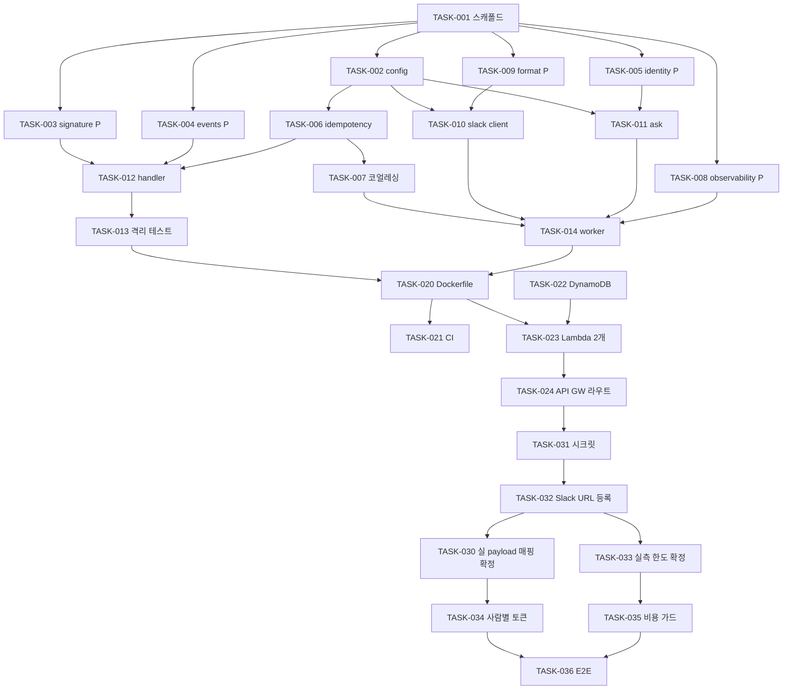

# Plan — Slackbot 연동 (Stage 3)

> `FRD.md`의 요구사항을 실행 가능한 Task로 분해.
> **ID 접두 `-SB-`는 이 워크스페이스의 FRD**, 접두 없는 `CTR-002`/`EDGE-016` 등은
> Stage 1 FRD(`../management-mcp-bootstrap-20260903/FRD.md`)를 가리킨다.

## 1. Approach

- **요약:** `servers/slackbot/`에 uv workspace 멤버를 새로 만들고, **순수 판정 로직(서명·멱등·자격·길이 정책)을
  먼저 확정**한 뒤 두 진입점(`handler.py` / `worker.py`)을 얹는다. 이미지는 1개, Lambda는 2개다.
  MCP 클라이언트는 구현하지 않고 Claude API MCP 커넥터에 위임한다(`DSN-SB-002`).

- **진입점 분기 메커니즘(FRD §4.4가 남긴 "Lambda마다 다른 핸들러"의 구체안):**
  - 이미지 1개 안에 ASGI 앱 팩토리 2개(`handler:create_app` / `worker:create_app`)를 둔다.
  - Lambda마다 `ImageConfig.Command`로 다른 팩토리를 지정한다 — 이미지를 둘로 나누면 빌드·스캔·배포가
    두 배가 되는데 얻는 게 없다(FRD §4.4).
  - **worker는 HTTP 트리거가 아니다.** LWA 공식 README 환경변수 표에서 확인:
    `AWS_LWA_PASS_THROUGH_PATH`(기본 `"/events"`) = *"the path for receiving event payloads from
    non-http triggers"*. 비동기 invoke의 원본 이벤트 페이로드가 이 경로로 들어온다 → worker도
    **검증된 LWA Dockerfile(`CTR-011`)을 그대로 재사용**하며 RIC를 따로 넣을 필요가 없다.
  - `DSN-SB-008`(handler는 Claude SDK를 import하지 않는다)은 **팩토리가 갈리므로 import 그래프도 갈린다**는
    사실에 의존한다. 의존성이 이미지에 들어 있는 것과 handler가 그것을 import하는 것은 다르다 —
    후자만 콜드스타트 비용이다. 이 불변식을 `TASK-013`이 테스트로 고정한다.

- **import 비용 실측(2026-09-14, Python 3.14.2 / macOS arm64 / `python -X importtime` 누적):**

  | 모듈 | import | 비고 |
  |---|---:|---|
  | `starlette.applications` | 37 ms | handler·worker 공통 |
  | `uvicorn` | 50 ms | handler·worker 공통 |
  | `boto3` | 385 ms | +클라이언트 생성 82 ms |
  | **`anthropic`** | **1,384 ms** | **worker 전용** |
  | (참고) `mcp` | 522 ms | Stage 1 서버가 지는 비용, 콜드스타트 실측 ~1,900 ms |

  **`DSN-SB-008`이 추론이 아니라 측정으로 확정됐다.** handler가 `anthropic`을 import하면 그 한 줄이
  **1,384 ms** — `CTR-SB-002` 3초 예산의 46%를 먹는다. Stage 1의 `mcp`(522 ms)로 콜드스타트가
  ~1,900 ms였음을 감안하면 handler는 그것만으로 예산을 넘길 공산이 크다.

  **`boto3`(385+82 ms)는 감수하되 감시 대상이다.** handler 경로에 반드시 필요하고(DynamoDB 조건부 쓰기 ·
  worker 비동기 호출) 예산의 16%라 지금은 수용한다. `TASK-033`의 `Init Duration` 실측이 3초를 위협하면
  **대안은 `httpx2` 위의 SigV4 직접 서명**이다 — 코드는 늘지만 import는 거의 0이다.

- **PR 분리:** **3개.** 기준은 **위험 축**이다 — 되돌리기 비용이 계층마다 다르다.
  - `PR1` 코드만. 되돌리기 = revert. AWS·외부 서비스에 흔적이 없다.
  - `PR2` **AWS 리소스 생성**. Stage 1·2와 달리 **상태 저장소(DynamoDB)가 처음 도입**된다.
    되돌리기 = 리소스 삭제이며 revert로 끝나지 않는다.
  - `PR3` **외부 서비스(Slack·Anthropic) 등록과 실측**. 되돌릴 수 없는 외부 상태를 만들고,
    **착수 블로커 3개(§2)가 전부 해소돼야만 시작할 수 있다** — 의존성 그래프의 자연 절단면이 여기에 있다.
  - PR 간 의존은 `PR1 → PR2 → PR3` 단방향이다.

- **블로커와 무관하게 끝까지 갈 수 있는 범위:** `PR1` 전체 + `PR2`의 스크립트 **작성**까지.
  실제 Slack 워크스페이스·Anthropic 키가 없어도 서명 검증·멱등·자격·응답 구성은 전부 테스트 가능하다
  (가짜 signing secret과 mock Claude 클라이언트로 충분하다). 막히는 것은 `PR3`뿐이다.

- **테스트 디렉터리 규약(`TASK-002`에서 발견·해결):** `servers/slackbot/tests/`에는 `__init__.py`를 **둔다**.
  워크스페이스에 `tests/conftest.py`가 둘이 되는 순간(management + slackbot), 패키지가 없으면 pytest가
  둘을 같은 bare 모듈명 `conftest`로 캐시해 **나중에 로드된 쪽이 앞을 덮어쓴다** — 재현 확인: management
  테스트 10개가 `ImportError: cannot import name 'make_settings' from 'conftest'`로 수집 실패.
  slackbot 쪽만 패키지화해 `tests.conftest`로 분리했다. **후속 태스크는 `from .conftest import X`(상대 임포트)를 쓴다.**

- **🔴 SDK DEBUG 로깅 함정(`TASK-011` 검증 중 발견 — `TASK-012`·`TASK-014`가 막아야 함):**
  `ask.py` 자신은 어떤 로그 레벨에서도 시크릿을 흘리지 않는다(실측: `question_len`만 남긴다).
  그러나 **`anthropic._base_client`가 DEBUG에서 `Request options: {...}`로 요청 body를 통째로 찍는다** —
  거기에는 **사람별 MCP 토큰과 질문 원문**이 들어 있다. `config.py`의 `SLACKBOT_LOG_LEVEL`은 `DEBUG`를
  허용하므로, 운영자가 장애 조사로 DEBUG를 켜는 순간 per-person 토큰이 CloudWatch에 장기 보존된다.
  → **진입점(`handler.py`/`worker.py`)에서 로깅을 구성할 때 `anthropic`·`httpx2` 로거를 앱 레벨과 무관하게
  최소 INFO로 고정**하고, 그 근거를 주석에 남긴다.

- **`EDGE-SB-019` 리스크 완화:** 실제 payload를 못 본 상태로 매핑 키를 코드 곳곳에 흩뿌리면
  나중에 전수 수정이 된다. `TASK-004`에서 **사용자 식별자 추출을 함수 1개로 국소화**해,
  `TASK-030`이 실 payload를 확인한 뒤 **그 함수만 고치면 끝나게** 만든다.

## 2. Resource Check (착수 전)

> FRD §6에서 가져옴. 🔴 = 사용자만 해소 가능한 **착수 블로커**.

- [ ] 🔴 `RES-SB-API-001` **Slack 앱** — Signing Secret · Bot Token(`xoxb-`, `chat:write`) · Bot User ID
      → 막는 Task: `TASK-030` `TASK-031` `TASK-032` `TASK-036`
- [ ] 🔴 `RES-SB-API-002` **Anthropic API 키** — 미보유 확인(`ant` CLI·환경변수 모두 없음)
      → 막는 Task: `TASK-031` `TASK-033` `TASK-035` `TASK-036`
- [ ] 🔴 `EDGE-SB-019` **실제 `app_mention` payload 1건** — 매핑 키 확정 전제
      → 막는 Task: `TASK-030` (그리고 `TASK-030`이 `TASK-036`을 막는다)
- [x] `RES-SB-API-003` `https://mcp.devoks.kr/mcp` — 가동 중
- [ ] `RES-SB-API-004` DynamoDB 멱등성 테이블 — `TASK-022`가 생성
- [ ] `RES-SB-API-005` Slack 워크스페이스 사용자 ID 목록 — `TASK-030`에서 실형태 확인 후 확정
- [ ] 참고 코드 접근: `servers/management/src/devoks_mcp_management/{config,auth/verifier,audit/logger}.py`
- [ ] 참고 코드 접근: `servers/management/Dockerfile` · `servers/management/tests/conftest.py`
- [ ] 참고 코드 접근: `infra/03-lambda.sh` · `infra/05-abuse-protection.sh`
- [ ] 외부 문서: Slack 요청 검증 / Events API / 메시지 절단 changelog (FRD §6.2)

## 3. Tasks

> 형식: `- [ ] TASK-ID [P?] 설명 — size — test — file — traces`

### PR1 — Slackbot 패키지와 순수 로직 (블로커 없음)

- [x] `TASK-001` `servers/slackbot/` uv workspace 멤버 스캐폴드 — 패키지 `pyproject.toml` 신규 + 루트 `pyproject.toml`의 `[tool.ruff] src`·`[tool.pyright] include`·`[tool.pytest.ini_options] testpaths` **3곳에 slackbot 경로 추가**(현재 셋 다 management만 가리킨다) — size: S — test: skip — file: `servers/slackbot/pyproject.toml`, `pyproject.toml` — traces: AC-SB-008-1, AC-SB-008-3
- [x] `TASK-002` 설정 Fail-Fast — 전 오류 수집 후 기동 실패, 시크릿 `repr` 은닉, **handler/worker 역할별 필수 키 분리**(FRD §5.2), 범위 검증. 테스트 픽스처 규약(`conftest.py`) 동반 — size: M — test: required — file: `servers/slackbot/src/devoks_slackbot/config.py`, `servers/slackbot/tests/conftest.py` — traces: CTR-SB-005, CTR-SB-007, AC-SB-005-5, DSN-SB-005, DSN-006
- [x] `TASK-003` [P] Slack 서명 검증 **순수 함수** — `v0:{ts}:{raw_body}` → HMAC-SHA256 → `v0=` + hex, 상수 시간 비교, 헤더명 대소문자 무관, 5분 윈도우. **`raw_body`는 파싱 전 바이트** — size: M — test: required — file: `servers/slackbot/src/devoks_slackbot/slack/signature.py` — traces: REQ-SB-001, AC-SB-001-1, AC-SB-001-2, AC-SB-001-3, AC-SB-001-4, AC-SB-001-5, CTR-SB-001, CTR-SB-003, EDGE-SB-001, EDGE-SB-002, DSN-SB-007
- [x] `TASK-004` [P] 이벤트 파싱 — `url_verification`/`app_mention` 판별, 봇 자기 메시지 판별, **사용자 식별자 추출을 함수 1개로 국소화**(`EDGE-SB-019` 대비) — size: M — test: required — file: `servers/slackbot/src/devoks_slackbot/slack/events.py` — traces: AC-SB-006-3, CTR-SB-006, EDGE-SB-011, EDGE-SB-019
- [x] `TASK-005` [P] Slack user ID → MCP 토큰 자격 조회 — 미등록 거부가 **다른 사용자 존재를 드러내지 않음**, 토큰 미출력, 매핑 크기 한계 경고 — size: M — test: required — file: `servers/slackbot/src/devoks_slackbot/identity.py` — traces: REQ-SB-004, AC-SB-004-1, AC-SB-004-2, AC-SB-004-3, AC-SB-004-4, CTR-SB-006, EDGE-SB-006, EDGE-SB-012, DSN-SB-003
- [x] `TASK-006` 멱등성 저장소 — `event_id` **조건부 쓰기**(`attribute_not_exists`)로 claim, 완료 기록, TTL. **동시 도착 시 하나만 통과**를 테스트로 고정 — size: M — test: required — file: `servers/slackbot/src/devoks_slackbot/idempotency.py` — traces: REQ-SB-003, AC-SB-003-1, AC-SB-003-2, AC-SB-003-3, CTR-SB-007, EDGE-SB-004, EDGE-SB-005, DSN-SB-004
- [x] `TASK-007` 진행 중 질의 코얼레싱 — 동일 사용자·동일 스레드에 처리 중 질의가 있으면 접수만 알리고 새 질의를 시작하지 않는다(연타 방어). `TASK-006`과 같은 저장소를 쓰되 키가 다르다 — size: M — test: required — file: `servers/slackbot/src/devoks_slackbot/idempotency.py` — traces: EDGE-SB-015
- [x] `TASK-008` [P] 관측 레코드 — JSON 1줄, `usage` 포함, **질문 원문 대신 길이와 해시 앞 16자** — size: M — test: required — file: `servers/slackbot/src/devoks_slackbot/observability.py` — traces: REQ-SB-007, AC-SB-007-1, AC-SB-007-2, AC-SB-007-3, CTR-SB-008, EDGE-SB-017, CTR-003
- [x] `TASK-009` [P] 응답 길이 정책 순수 함수 — 3,500자 상한, 초과 시 **절단 사실 명시**, 경계값 ±1 — size: M — test: required — file: `servers/slackbot/src/devoks_slackbot/slack/format.py` — traces: AC-SB-006-2, CTR-SB-005, EDGE-SB-010
- [x] `TASK-010` `chat.postMessage` 래퍼 — `thread_ts` 게시, 접수 알림, **`not_in_channel` 등 오류 분류** — size: M — test: required — file: `servers/slackbot/src/devoks_slackbot/slack/client.py` — traces: REQ-SB-006, AC-SB-006-1, AC-SB-006-4, EDGE-SB-020
- [x] `TASK-011` Claude API 질의 — **`mcp_servers`와 `mcp_toolset`을 한 함수에서 함께 구성**해 분리 불가능하게, `authorization_token`에 그 사람 토큰, `refusal` 처리, 오류 시 내부 정보 미노출, **스레드 히스토리 미탑재**, 자체 재시도 루프 없음 — size: M — test: required — file: `servers/slackbot/src/devoks_slackbot/ask.py` — traces: REQ-SB-005, AC-SB-005-1, AC-SB-005-2, AC-SB-005-3, AC-SB-005-4, AC-SB-005-5, CTR-SB-004, EDGE-SB-008, EDGE-SB-009, EDGE-SB-014, EDGE-SB-016, DSN-SB-002
- [x] `TASK-012` ACK 경로 진입점 — 서명 검증 → `url_verification` challenge 반환 → 멱등 claim → 비동기 전달 → **즉시 200**. 비동기 전달 실패도 200(로그만). **Claude·MCP 호출 없음** — size: M — test: required — file: `servers/slackbot/src/devoks_slackbot/handler.py` — traces: REQ-SB-002, AC-SB-001-2, AC-SB-001-6, AC-SB-002-1, AC-SB-002-2, AC-SB-002-3, CTR-SB-002, EDGE-SB-001, EDGE-SB-003, EDGE-SB-004, DSN-SB-001, DSN-SB-008
- [x] `TASK-013` handler 의존성 격리 **불변식 테스트** — `handler`를 import한 뒤 `sys.modules`에 `anthropic`이 없음을 강제. 이 가드가 없으면 무심한 import 한 줄이 3초 예산을 먹는다 — size: M — test: required — file: `servers/slackbot/tests/test_handler_isolation.py` — traces: EDGE-SB-007, DSN-SB-008
- [x] `TASK-014` 비동기 경로 진입점 — LWA 패스스루(`/events`)로 원본 이벤트 수신 → 자격 조회 → 접수 알림 → `ask` → 길이 정책 → 게시 → 관측 레코드. **worker에서도 멱등 판정**(Lambda 비동기 재시도 2회 대비), 타임아웃 시 사용자에게 실패 고지 — size: M — test: required — file: `servers/slackbot/src/devoks_slackbot/worker.py` — traces: AC-SB-006-4, CTR-SB-009, EDGE-SB-005, EDGE-SB-006, EDGE-SB-013

### PR2 — 패키징 · 배포 인프라 (AWS 리소스 생성)

- [x] `TASK-020` Slackbot 컨테이너 이미지 — `servers/management/Dockerfile` 패턴 복제(arm64 · LWA 1.1.0 · 비루트 · `/healthz`), **`AWS_LWA_PASS_THROUGH_PATH` 설정**, 기본 `CMD`는 handler 팩토리 — size: M — test: skip — file: `servers/slackbot/Dockerfile` — traces: AC-SB-008-2, CTR-010, CTR-011, DSN-SB-006
- [x] `TASK-021` CI 확장 — `quality` 잡이 slackbot 경로도 검사하고, `docker` 잡에 slackbot 이미지 빌드 + `/healthz` 스모크 + ECR 푸시를 추가 — size: M — test: skip — file: `.github/workflows/ci.yml` — traces: AC-SB-008-3
- [x] `TASK-022` 멱등성 테이블 프로비저닝 — DynamoDB on-demand + TTL 속성, 최소 권한 IAM 정책 — size: M — test: skip — file: `infra/06-idempotency-table.sh` — traces: CTR-SB-007, DSN-SB-004
- [x] `TASK-023` Lambda 2개 프로비저닝 — 같은 이미지 + `ImageConfig.Command`로 진입점 분기, **역할별 환경변수·권한 분리**(handler는 DynamoDB+invoke, worker는 DynamoDB+SSM), worker 한도 `300s / 1024MB`, 시크릿은 SSM `SecureString`, **환경변수 4 KB 총량 확인** — size: M — test: skip — file: `infra/07-slackbot-lambda.sh` — traces: AC-SB-008-2, CTR-SB-009, EDGE-SB-012, EDGE-SB-013, EDGE-SB-016, EDGE-SB-018, DSN-SB-001, EDGE-021
- [x] `TASK-024` API Gateway Slack 라우트 — 기존 HTTP API에 라우트 추가, Stage 2 스로틀(`rate 10/s · burst 20`) 상속 확인, 예약 동시성 — size: M — test: skip — file: `infra/08-slackbot-route.sh` — traces: CTR-SB-002, EDGE-018, EDGE-022

### PR3 — 실환경 연결 · 실측 (🔴 블로커 해소 후)

- [ ] `TASK-030` 🔴 **실 `app_mention` payload 1건 확인 → 매핑 키 확정** — 사용자 식별자 필드·형식을 실물로 대조하고 `TASK-004`의 추출 함수를 확정한다. 가정이 틀렸다면 **유닛테스트는 통과한 채 실환경에서 전원 미등록으로 떨어진다** — size: M — test: required — file: `servers/slackbot/src/devoks_slackbot/slack/events.py` — traces: CTR-SB-006, EDGE-SB-019
- [x] `TASK-031` 🔴 시크릿 등록 — Slack Signing Secret·Bot Token·Bot User ID·Anthropic API 키를 SSM `SecureString`에 넣고 Lambda에 주입. **값은 대화·로그·커밋 어디에도 남기지 않는다** — size: M — test: skip — file: `infra/07-slackbot-lambda.sh` — traces: EDGE-SB-018
- [ ] `TASK-032` 🔴 Slack Event Subscription URL 등록 — `url_verification` 핸드셰이크가 **서명 검증을 통과한 뒤** challenge를 반환하는지 실물 확인, `app_mention` 구독 — size: M — test: skip — file: `docs/RUNBOOK-slackbot.md` — traces: AC-SB-001-6, EDGE-SB-003
- [ ] `TASK-033` 🔴 실측 → 한도 확정 — handler `Init Duration`이 3초 예산 안인지, worker 실제 소요가 `300s/1024MB` 안인지 측정해 `CTR-SB-002`·`CTR-SB-009`를 확정한다(FRD §10 미결 1) — size: M — test: skip — file: `infra/07-slackbot-lambda.sh` — traces: CTR-SB-002, CTR-SB-009, EDGE-SB-007
- [ ] `TASK-034` 사람별 MCP 토큰 발급 — MCP 서버 `MCP_CLIENT_TOKENS`에 사람마다 1행 추가(`CTR-002` 스키마 그대로, **서버 코드 변경 없음**) + Slackbot 매핑 반영 — size: S — test: skip — file: `infra/02-secrets.sh` — traces: CTR-SB-006, CTR-002
- [ ] `TASK-035` 🔴 Claude API 비용 가드 — Anthropic Console 사용량 한도 설정(**AWS 예산 알림은 이 비용을 잡지 못한다**) + 운영 런북에 관측 레코드로 사후 집계하는 절차 기록 — size: M — test: skip — file: `docs/RUNBOOK-slackbot.md` — traces: EDGE-SB-017
- [ ] `TASK-036` 🔴 E2E 검증 — 실제 채널에서 멘션 → 스레드 답변 게시, 미등록 사용자 거부, 재시도 중복 억제, 연타 코얼레싱, per-person 감사 레코드의 `client_id`가 사람인지 확인 — size: M — test: skip — file: `docs/RUNBOOK-slackbot.md` — traces: AC-SB-003-1, AC-SB-004-2, AC-SB-006-1, EDGE-SB-004, EDGE-SB-015, EDGE-SB-020

## 4. Dependencies

## 5. Definition of Done

- [ ] 모든 Task 완료
- [ ] 모든 `AC-SB`/`CTR-SB`/`EDGE-SB`가 Task `traces`로 커버됨 (누락 0 — `references/traceability.md` 스크립트로 판정)
- [ ] 핵심 판정 로직 테스트 통과 — 서명(정상·변조·5분 밖·헤더 대소문자·재직렬화 불일치) / 멱등(신규·중복·**동시 도착 원자성**) / 자격(등록·미등록·정보 미누출·토큰 미출력) / `ask`(**`mcp_servers`+`mcp_toolset` 동반 구성**) / 길이 경계값 / 봇 자기판별
- [ ] handler 의존성 격리 불변식 통과(`TASK-013`) — handler import 그래프에 Claude SDK 없음
- [ ] CI 품질 게이트(ruff·pyright strict·pytest·OSV) 통과
- [ ] handler `Init Duration` 실측이 `CTR-SB-002` 3초 예산 안 (`TASK-033`)
- [ ] 실 Slack 워크스페이스에서 멘션 → 스레드 답변 왕복 성공, 감사 레코드 `client_id`가 사람 (`TASK-036`)
- [ ] Anthropic Console 사용량 한도 설정 완료 (`TASK-035`)
- [ ] 시크릿 값이 대화·로그·커밋·Slack 메시지 어디에도 남지 않음
