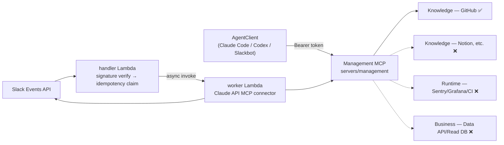
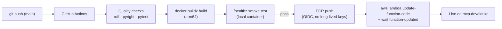

# devoks-mcp-servers

> **한국어 문서**: [docs/README.ko.md](docs/README.ko.md)

A collection of MCP servers (a uv workspace monorepo) that exposes internal project/service
knowledge and state through a **single MCP endpoint** to multiple agent clients (Claude Code,
Codex, Slackbot, etc.).


---

## Project Composition

| Server | Path | Description |
|---|---|---|
| Management MCP | [`servers/management`](servers/management) | The knowledge gateway (`devoks-management-mcp`) that agent clients connect to directly — owns the Knowledge/Runtime/Business adapters and the Auth/RBAC/Audit skeleton. MCP server built on the GitHub Knowledge adapter (`mcp` SDK + Starlette). Live at `https://mcp.devoks.kr/mcp` |
| Slackbot | [`servers/slackbot`](servers/slackbot) | A channel, not a knowledge source of its own — authenticates a Slack user and relays their question to Management MCP. Bridges the Slack Events API and the Claude API MCP connector. Deployed as two AWS Lambdas (handler/worker), running in a Slack workspace |

## Directory Structure

```
devoks-mcp-servers/
├── servers/
│   ├── management/        # MCP server built on the GitHub Knowledge adapter
│   │   ├── src/devoks_mcp_management/
│   │   └── tests/
│   └── slackbot/           # Slack ↔ Claude bridge (handler/worker Lambdas)
│       ├── src/devoks_slackbot/
│       └── tests/
├── infra/                  # AWS deployment scripts (numbered 01~11; each script documents its own run order)
├── docs/                    # Per-server guides · workflow narrative
├── .claude/
│   ├── CLAUDE.md            # Project facts SSOT
│   ├── rules/project-convention.md  # Coding convention SSOT
│   └── workspace/           # Per-server FRD/PLAN (requirements, design, task breakdown)
└── README.md
```

## Architecture

`AgentClient → Management MCP → Knowledge / Runtime / Business` — a three-layer adapter
architecture. Only the GitHub adapter in the Knowledge layer is implemented so far.



| Layer | Status |
|---|---|
| Knowledge — GitHub (read) | ✅ Implemented (`list_repos`, `get_repo_tree`, `read_file`, `search_code`) |
| Knowledge — GitHub write (issue creation, code-editing PRs) | ❌ Not implemented — roadmap: [docs/roadmap.md](docs/roadmap.md) |
| Knowledge — Notion, PRD/TRD, etc. | ❌ Not implemented |
| Runtime — Sentry/Grafana/CloudWatch/GitHub CI | ❌ Not implemented |
| Business — Data API/Read DB/Analytics | ❌ Not implemented |
| AWS Lambda production deployment | ✅ Live at `mcp.devoks.kr`, with four layers of abuse protection |
| Slackbot | ✅ Deployed as AWS Lambda (handler/worker), confirmed working in a Slack workspace |

The Auth (Bearer token verification), RBAC (role × tool × repo authorization), and Audit
(audit logging) skeleton is fixed so it doesn't change as more layers are added.

## Tech Stack

- **Language/package management**: Python 3.14+ (a floor, since it depends on PEP 758 syntax), [uv](https://docs.astral.sh/uv/) workspace monorepo
- **Management MCP**: `mcp` SDK (`mcp==2.1.1`) + Starlette + uvicorn
- **Slackbot**: Starlette + uvicorn, AWS Lambda Web Adapter, boto3 (DynamoDB), `anthropic` (Claude API MCP connector)
- **Lint/Format**: Ruff · **Type check**: pyright (strict) · **Test**: pytest + pytest-asyncio
- **Deployment**: AWS Lambda + ECR + GitHub OIDC + SSM Parameter Store, managed with `infra/*.sh` scripts (no Terraform/CDK)

## Prerequisites

| Tool | Version | Purpose |
|---|---|---|
| Python | `>= 3.14` (floor — earlier versions raise a `SyntaxError` at import time) | Runtime |
| uv | Latest | Dependency management |
| Docker (optional) | buildx | Only when building the container image directly — not required locally |
| AWS CLI (optional) | Latest, credentials via `aws configure` | Only when running the `infra/*.sh` deployment scripts |

## Getting Started

```bash
git clone https://github.com/ridsync/devoks-mcp-servers.git
cd devoks-mcp-servers

# Install dependencies for the whole workspace
uv sync

# Prepare environment variables for running management locally
cp .env.example .env
# Open .env and fill in at least GITHUB_APP_PRIVATE_KEY with a valid PEM.
# For the full list of required keys and gotchas, see the "환경변수" section of docs/management-guide.md.

# Verify the install
uv run pytest -q
```

## Per-Server Guides

| Guide | Contents |
|---|---|
| [docs/management-guide.md](docs/management-guide.md) | Local run, environment variables, MCP client registration, auth/authz, GitHub query tools, audit logging, container build, known constraints |
| [docs/slackbot-guide.md](docs/slackbot-guide.md) | Processing flow (handler/worker), idempotency, deployment infrastructure |

## Development Workflow

Commands used day-to-day to make and verify code changes. Run all of them from the repository
root — `pytest`/`ruff`/`pyright` are all configured in the root `pyproject.toml` (the workspace
SSOT), so there's no need to change directories per server.

| Situation | Command |
|---|---|
| Reinstall dependencies (e.g. after a lockfile change) | `uv sync` |
| Run the full test suite | `uv run pytest -q` (659 tests) |
| Lint check / auto-format | `uv run ruff check .` / `uv run ruff format .` |
| Type check | `uv run pyright` |
| Start the management server locally | [docs/management-guide.md#빠른-시작](docs/management-guide.md#빠른-시작) |
| Build the container locally | [docs/management-guide.md#컨테이너-빌드](docs/management-guide.md#컨테이너-빌드) |

## Deployment

Both servers deploy through the same mechanism: **AWS Lambda runs the container image
as-is** (the AWS Lambda Web Adapter runs a regular ASGI app on Lambda unmodified, so
there's no need to rewrite the code specifically for Lambda).

It matters that **"bootstrapping infrastructure" and "deploying code" are separate
concerns** — the former happens once per AWS account and is done manually by a person,
while the latter runs automatically via CI on every merge to `main`.

### Code Deployment Pipeline (automatic on every push to `main`)



- **Only images that pass the smoke test get pushed to ECR** — this structurally prevents
  a broken image from being deployed (the `docker` job in `.github/workflows/ci.yml`).
- GitHub Actions only uses **short-lived tokens issued via OIDC** — no long-lived AWS
  access keys are kept in the repository.
- All a developer needs to do is **merge to `main`**. Everything after that (build, test,
  deploy) is automatic. Both management and slackbot run through the same pipeline.

### Initial Infrastructure Bootstrap (manual, once per AWS account)

For the pipeline above to work, AWS resources such as the ECR repository, Lambda
functions, secrets, and the domain need to exist first. These are created once via the
numbered scripts under `infra/`:

| Step | Script | Creates |
|---|---|---|
| 1 | `01-ecr-and-github-oidc.sh` | ECR repository + GitHub Actions OIDC role |
| 2 | `02-secrets.sh` | Registers secrets in SSM Parameter Store (SecureString) |
| 3 | `03-lambda.sh` | Lambda function + Function URL |
| 4 | `04-custom-domain.sh` | API Gateway HTTP API + custom domain (`mcp.devoks.kr`) |
| 5 | `05-abuse-protection.sh` | Throttling, reserved concurrency, budget alerts |
| 6~8 | `06`~`08` | Slackbot's DynamoDB idempotency table, two Lambdas (handler/worker), event routes |
| 9~11 | `09`~`11` | Slackbot secrets, ECR/OIDC extension, per-person MCP token issuance |

```bash
# Example: initial bootstrap for management infrastructure
AWS_PROFILE=devoks ./infra/01-ecr-and-github-oidc.sh
AWS_PROFILE=devoks ./infra/02-secrets.sh
AWS_PROFILE=devoks ./infra/03-lambda.sh
AWS_PROFILE=devoks ./infra/04-custom-domain.sh
AWS_PROFILE=devoks ./infra/05-abuse-protection.sh
```

Each script safely no-ops with "already exists" if a resource is already there (safe to
re-run). Before running, always read **the comment block at the top of each script**
(prerequisites, verified-execution status) — in particular, `06`~`08` state explicitly in
the scripts themselves whether they've actually been run yet, since within this repository
they've only passed a syntax check so far.

Management MCP runs live at `mcp.devoks.kr`, and Slackbot runs live as two Lambdas
(handler/worker).

## Further Reading

- [`.claude/CLAUDE.md`](.claude/CLAUDE.md) — Project facts SSOT (tech stack, commands, architecture, sensitive files)
- [`.claude/rules/project-convention.md`](.claude/rules/project-convention.md) — Coding convention SSOT
- [docs/WORKFLOW.md](docs/WORKFLOW.md) — The overall workflow (why this order, what turned out differently in practice)
- [docs/roadmap.md](docs/roadmap.md) — Planned expansion specs (ideas not yet finalized as an FRD, such as GitHub write access)
- [docs/build-vs-buy-agent-platform.md](docs/build-vs-buy-agent-platform.md) — Comparison against turnkey agent solutions like Claude Tag, as a reference for build-vs-buy architecture decisions
- [`.claude/workspace/management-mcp-bootstrap-20260903/FRD.md`](.claude/workspace/management-mcp-bootstrap-20260903/FRD.md) / `PLAN.md` — Management requirements, design, task breakdown
- [`.claude/workspace/slackbot-integration-20260914/FRD.md`](.claude/workspace/slackbot-integration-20260914/FRD.md) / `PLAN.md` — Slackbot requirements, design, task breakdown

## License

MIT License — Copyright (c) 2026 DevOKs-Lab. See [LICENSE.md](LICENSE.md) for the full text.
