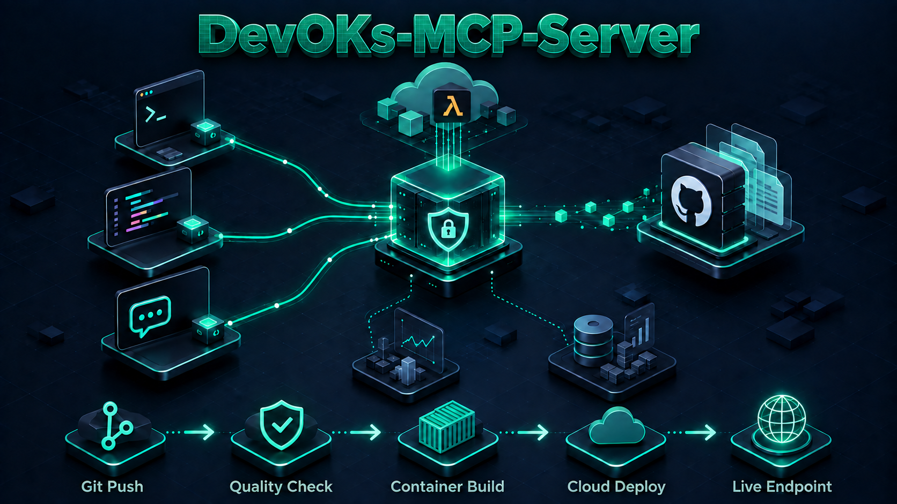
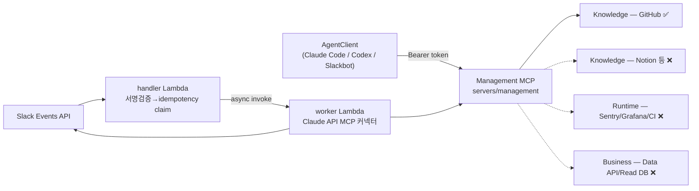
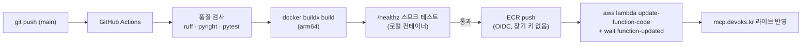

# devoks-mcp-servers

> **English document**: [../README.md](../README.md)

사내 프로젝트/서비스의 지식·상태를 여러 에이전트 클라이언트(Claude Code, Codex, Slackbot 등)에서
**단일 MCP 엔드포인트**로 조회하기 위한 MCP 서버 모음(uv workspace 모노레포)입니다.



---

## 프로젝트 구성

| 서버 | 경로 | 설명 |
|---|---|---|
| Management MCP | [`servers/management`](../servers/management) | GitHub Knowledge 어댑터 기반 MCP 서버(`mcp` SDK + Starlette). `https://mcp.devoks.kr/mcp`에서 서비스 중 |
| Slackbot | [`servers/slackbot`](../servers/slackbot) | Slack Events API ↔ Claude API MCP 커넥터 브리지. AWS Lambda(handler/worker)로 배포돼 Slack 워크스페이스에서 동작 |

## 디렉토리 구조

```
devoks-mcp-servers/
├── servers/
│   ├── management/        # GitHub Knowledge 어댑터 기반 MCP 서버
│   │   ├── src/devoks_mcp_management/
│   │   └── tests/
│   └── slackbot/           # Slack ↔ Claude 브릿지 (handler/worker Lambda)
│       ├── src/devoks_slackbot/
│       └── tests/
├── infra/                  # AWS 배포 스크립트 (01~11 순번, infra/*.sh 자체에 실행 순서 주석)
├── docs/                    # 서버별 상세 가이드 · 작업 흐름 서술
├── .claude/
│   ├── CLAUDE.md            # 프로젝트 사실 SSOT
│   ├── rules/project-convention.md  # 코딩 규범 SSOT
│   └── workspace/           # 서버별 FRD/PLAN(요구사항·설계·작업 분해)
└── README.md
```

## 아키텍처

AgentClient → Management MCP → **Knowledge / Runtime / Business** 3계층 어댑터로 구성됩니다.
현재는 Knowledge 계층의 GitHub 어댑터 하나만 구현돼 있습니다.



| 계층 | 구현 |
|---|---|
| Knowledge — GitHub (읽기) | ✅ 구현됨 (`list_repos`, `get_repo_tree`, `read_file`, `search_code`) |
| Knowledge — GitHub 쓰기(이슈 생성·코드 수정 PR) | ❌ 미구현 — 로드맵: [roadmap.md](roadmap.md) |
| Knowledge — Notion, PRD/TRD 등 | ❌ 미구현 |
| Runtime — Sentry/Grafana/CloudWatch/GitHub CI | ❌ 미구현 |
| Business — Data API/Read DB/Analytics | ❌ 미구현 |
| AWS Lambda 실배포 | ✅ `mcp.devoks.kr`에서 서비스 중, 오남용 방지 4중 적용 |
| Slackbot | ✅ AWS Lambda(handler/worker)로 배포, Slack 워크스페이스에서 동작 확인됨 |

Auth(Bearer 토큰 검증)·RBAC(역할×툴×저장소 인가)·Audit(감사 로그) 골격은 계층이 늘어나도
바뀌지 않도록 고정돼 있습니다.

## 기술 스택

- **언어/패키지 관리**: Python 3.14+ (하한, PEP 758 문법 의존), [uv](https://docs.astral.sh/uv/) workspace 모노레포
- **Management MCP**: `mcp` SDK(`mcp==2.1.1`) + Starlette + uvicorn
- **Slackbot**: Starlette + uvicorn, AWS Lambda Web Adapter, boto3(DynamoDB), `anthropic`(Claude API MCP 커넥터)
- **Lint/Format**: Ruff · **Type Check**: pyright(strict) · **Test**: pytest + pytest-asyncio
- **배포**: AWS Lambda + ECR + GitHub OIDC + SSM Parameter Store, `infra/*.sh` 스크립트로 관리(Terraform/CDK 미사용)

## 사전 요구사항

| 도구 | 버전 | 용도 |
|---|---|---|
| Python | `>= 3.14` (하한, 하위 버전은 import 시점 SyntaxError) | 실행 |
| uv | 최신 | 의존성 관리 |
| Docker (선택) | buildx | 컨테이너 직접 빌드할 때만 — 로컬 필수 아님 |
| AWS CLI (선택) | 최신, `aws configure`로 자격 증명 설정 | `infra/*.sh` 배포 스크립트를 실행할 때만 |

## 초기 설정

```bash
git clone https://github.com/ridsync/devoks-mcp-servers.git
cd devoks-mcp-servers

# 워크스페이스 전체 의존성 설치
uv sync

# management 로컬 실행용 환경변수 준비
cp .env.example .env
# .env를 열어 최소한 GITHUB_APP_PRIVATE_KEY를 유효한 PEM으로 채운다.
# 필수 키 전체 목록과 함정은 management-guide.md "환경변수" 절 참고.

# 설치 확인
uv run pytest -q
```

## 서버별 가이드

| 가이드 | 내용 |
|---|---|
| [management-guide.md](management-guide.md) | 로컬 실행, 환경변수, MCP 클라이언트 등록, 인증/인가, GitHub 조회 툴, 감사 로그, 컨테이너 빌드, 알려진 제약 |
| [slackbot-guide.md](slackbot-guide.md) | 처리 흐름(handler/worker), 멱등성, 배포 인프라 |

## 개발 흐름

일상적으로 코드를 고치고 검증할 때 쓰는 커맨드입니다. 전부 저장소 루트에서 실행합니다
— `pytest`/`ruff`/`pyright` 설정이 전부 루트 `pyproject.toml`에 있어서(워크스페이스
SSOT) 서버별로 작업 디렉터리를 옮길 필요가 없습니다.

| 상황 | 커맨드 |
|---|---|
| 의존성 재설치(락파일 변경 후 등) | `uv sync` |
| 전체 테스트 | `uv run pytest -q` (659 tests) |
| lint 검사 / 자동 포맷 | `uv run ruff check .` / `uv run ruff format .` |
| 타입 체크 | `uv run pyright` |
| management 로컬 서버 기동 | [management-guide.md#빠른-시작](management-guide.md#빠른-시작) |
| 컨테이너 로컬 빌드 | [management-guide.md#컨테이너-빌드](management-guide.md#컨테이너-빌드) |

## 배포

두 서버 모두 같은 메커니즘으로 배포됩니다: **컨테이너 이미지를 AWS Lambda가 그대로
실행**합니다(AWS Lambda Web Adapter가 일반 ASGI 앱을 Lambda 위에서 그대로 구동시켜
주므로, 코드를 Lambda 전용으로 다시 짤 필요가 없습니다).

**"인프라를 처음 만드는 것"과 "코드를 배포하는 것"은 서로 다른 일**이라는 점이
중요합니다 — 전자는 AWS 계정당 한 번, 사람이 수동으로 하는 일이고, 후자는 `main`에
머지될 때마다 CI가 자동으로 하는 일입니다.

### 코드 배포 파이프라인 (매 `main` push마다 자동)



- **스모크 테스트를 통과한 이미지만 ECR에 올라갑니다** — 깨진 이미지가 배포되는 걸
  구조적으로 막습니다(`.github/workflows/ci.yml`의 `docker` 잡).
- GitHub Actions는 **OIDC로 발급받은 임시 토큰**만 사용합니다 — 저장소에 장기 AWS
  액세스 키를 두지 않습니다.
- 개발자가 할 일은 **`main`에 머지하는 것뿐**입니다. 그 이후(빌드·테스트·배포)는
  전부 자동입니다. management·slackbot 두 서버 모두 같은 파이프라인을 탑니다.

### 인프라 최초 구축 (수동, AWS 계정당 1회)

위 파이프라인이 동작하려면 ECR 리포지토리·Lambda 함수·시크릿·도메인 같은 AWS 리소스가
먼저 있어야 합니다. `infra/` 아래 순번 스크립트로 한 번만 만듭니다:

| 단계 | 스크립트 | 만드는 것 |
|---|---|---|
| 1 | `01-ecr-and-github-oidc.sh` | ECR 리포지토리 + GitHub Actions OIDC 역할 |
| 2 | `02-secrets.sh` | 시크릿을 SSM Parameter Store(SecureString)에 등록 |
| 3 | `03-lambda.sh` | Lambda 함수 + Function URL |
| 4 | `04-custom-domain.sh` | API Gateway HTTP API + 커스텀 도메인(`mcp.devoks.kr`) |
| 5 | `05-abuse-protection.sh` | 스로틀링·예약 동시성·예산 알림 |
| 6~8 | `06`~`08` | Slackbot용 DynamoDB 멱등성 테이블·Lambda 2개(handler/worker)·이벤트 라우트 |
| 9~11 | `09`~`11` | Slackbot 시크릿·ECR/OIDC 확장·사람별 MCP 토큰 발급 |

```bash
# 예: management 인프라 최초 구축
AWS_PROFILE=devoks ./infra/01-ecr-and-github-oidc.sh
AWS_PROFILE=devoks ./infra/02-secrets.sh
AWS_PROFILE=devoks ./infra/03-lambda.sh
AWS_PROFILE=devoks ./infra/04-custom-domain.sh
AWS_PROFILE=devoks ./infra/05-abuse-protection.sh
```

각 스크립트는 이미 존재하는 리소스를 다시 만들려 하면 "already exists"로 안전하게
넘어갑니다(재실행 가능). 실행 전 **각 스크립트 상단 주석**(전제 조건·실행 검증 상태)을
반드시 먼저 읽으세요 — 특히 `06`~`08`은 이 저장소 안에서는 문법 검사만 거쳤을 뿐 실제
실행 여부가 스크립트 자체에 명시돼 있습니다.

Management MCP는 `mcp.devoks.kr`에서, Slackbot은 handler/worker Lambda 2개로 실제
운영 중입니다.

## 참고 문서

- [`../.claude/CLAUDE.md`](../.claude/CLAUDE.md) — 프로젝트 사실 SSOT(기술 스택·커맨드·아키텍처·민감 파일)
- [`../.claude/rules/project-convention.md`](../.claude/rules/project-convention.md) — 코딩 규범 SSOT
- [WORKFLOW.md](WORKFLOW.md) — 전체 작업 흐름(왜 이 순서, 무엇이 실측으로 뒤집혔는지)
- [roadmap.md](roadmap.md) — 확장 예정 스펙(GitHub 쓰기 권한 등 아직 FRD로 확정되지 않은 아이디어)
- [`../.claude/workspace/management-mcp-bootstrap-20260903/FRD.md`](../.claude/workspace/management-mcp-bootstrap-20260903/FRD.md) / `PLAN.md` — Management 요구사항·설계·작업 분해
- [`../.claude/workspace/slackbot-integration-20260914/FRD.md`](../.claude/workspace/slackbot-integration-20260914/FRD.md) / `PLAN.md` — Slackbot 요구사항·설계·작업 분해
