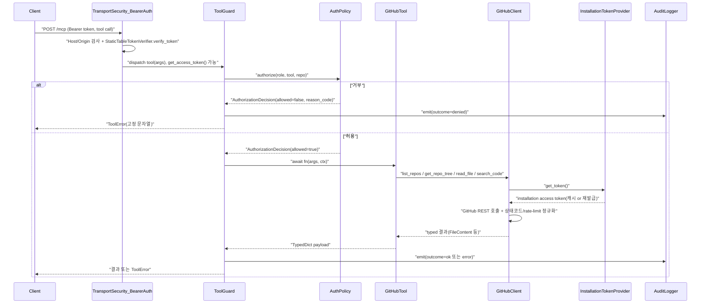
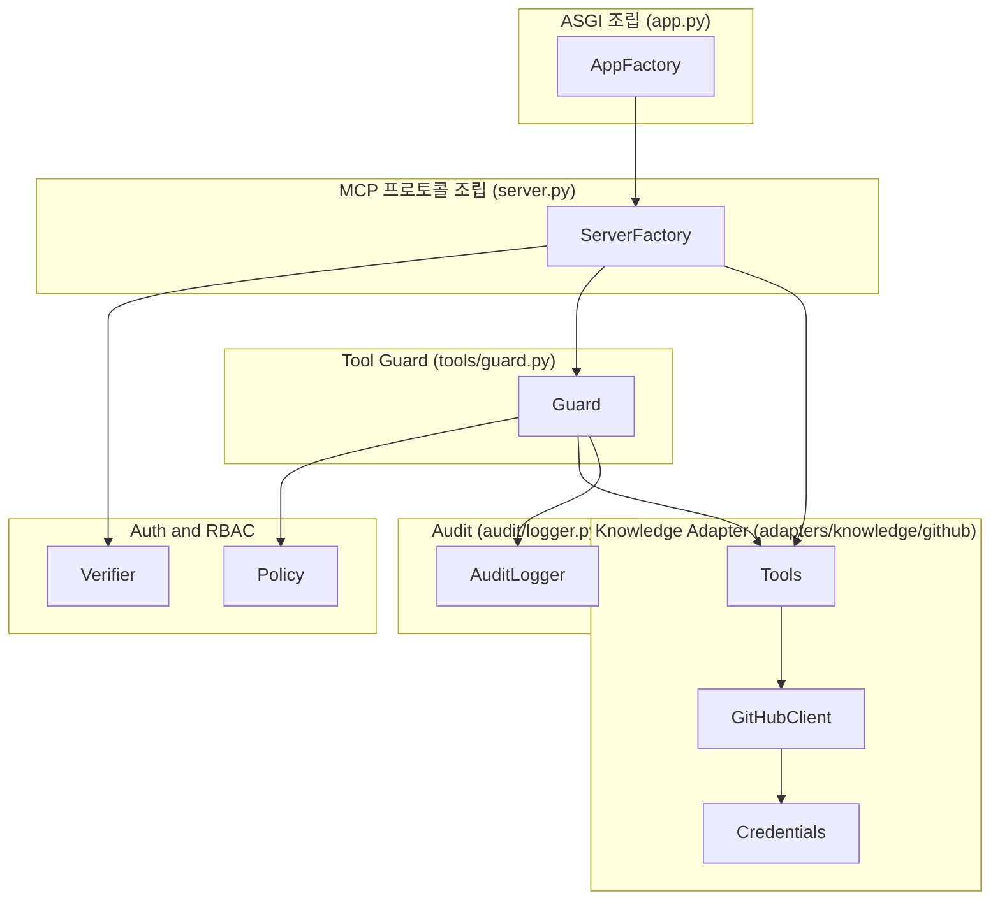
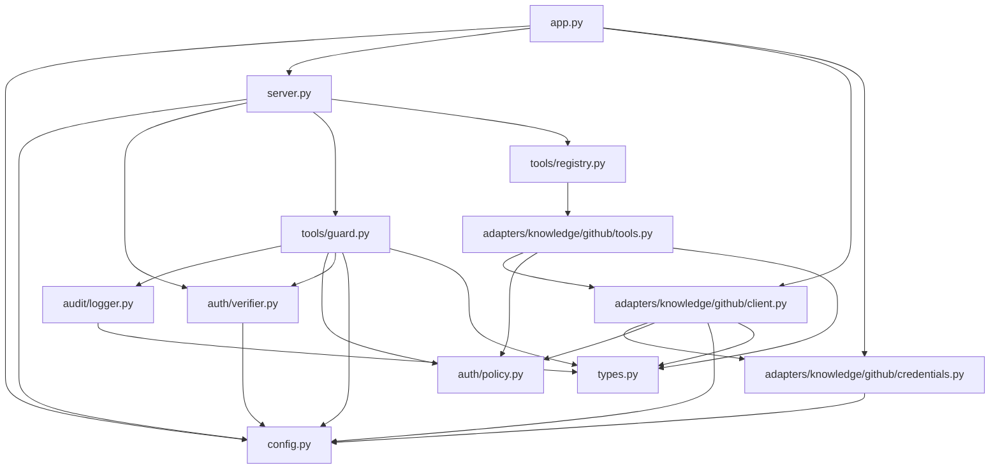

# servers/management 코드 분석

## 분석 목적과 접근

- **목적**: `servers/management`(Management MCP 서버)를 처음 읽는 개발자가 온보딩 시 빠르게
  파악해야 할 것 — 기동 순서, 인증(Bearer)→인가(role×tool×repo)→감사(JSON Lines) 3중 경계가
  코드 어디서 강제되는지, GitHub Knowledge 어댑터가 어떻게 붙어 있는지 — 를 정리한다. 이 서버는
  `mcp.devoks.kr`에 AWS Lambda(Function URL, Lambda Web Adapter)로 실배포된 상태이므로, 특히
  인증/인가/감사 경계의 정확한 서술을 우선순위로 삼았다.
- **접근**: `servers/management/src/devoks_mcp_management/` 하위 15개 소스 파일(총 3,677
  라인)을 전부 읽고, import 그래프를 따라 `config.py`(설정 SSOT) → `app.py`/`server.py`
  (composition root) → `auth/*`(인증·인가) → `tools/*`(가드·레지스트리) →
  `adapters/knowledge/github/*`(GitHub 어댑터) → `types.py`(도메인 상수) 순으로 확장해 읽었다.
  테스트 디렉토리(`servers/management/tests/`)는 파일명·테스트 함수 개수만 확인했고 본문 로직은
  src 코드를 기준으로 서술했다. `Dockerfile`·`pyproject.toml`은 배포 계약(CTR-010/011) 확인용으로
  읽었다.
- **Spec**: `.claude/workspace/management-mcp-bootstrap-20260903/FRD.md`(REQ-001~008 EARS
  요구사항, DSN-001~008 설계 결정, CTR-001~011 계약, §5.4 상태 전이표)와 같은 디렉토리의
  `PLAN.md`(TASK 분해)를 확인했다. 코드 주석이 `AC-*`/`CTR-*`/`DSN-*`/`EDGE-*`/`TASK-*` ID로
  FRD를 직접 인용하고 있어 본문에서도 그 ID를 그대로 인용한다. 스펙과 코드가 어긋난 지점은
  아래에 명시했다(§6.4 하단 참고 — `tools/registry.py` docstring이 계획 당시 문구를 그대로
  남겨둔 사례).
- **테스트**: `servers/management/tests/test_<module>.py` — src와 1:1, flat 구조. 14개 파일,
  총 267개 테스트 함수(`grep -c` 실측): `test_config.py`(42), `test_github_client.py`(58),
  `test_guard.py`(23), `test_credentials.py`(20), `test_policy.py`(20), `test_audit_logger.py`(19),
  `test_verifier.py`(15), `test_app.py`(15), `test_github_tools.py`(16), `test_server.py`(10),
  `test_github_tools_wiring.py`(11), `test_github_lifespan.py`(7), `test_http_auth.py`(7),
  `test_registry.py`(4). `conftest.py`는 fail-fast 검증을 위한 PEM 생성기(`generate_pem`)와
  `Settings` 팩토리(`make_settings`) 등 공용 fixture를 둔다.
- **관련 문서**:
  - [`docs/management-guide.md`](../docs/management-guide.md) — 실행·환경변수·MCP 클라이언트
    등록·컨테이너 빌드 가이드(이 분석 문서와 상호보완, 실행법은 그쪽이 SSOT).
  - `.claude/workspace/management-mcp-bootstrap-20260903/FRD.md` / `PLAN.md` — 요구사항·설계·
    계약·태스크 원본.
  - [`docs/WORKFLOW.md`](../docs/WORKFLOW.md) — 전체 작업 흐름/근거.
  - `.claude/rules/project-convention.md` — 코딩 규범 SSOT(본문엔 규범 자체를 옮기지 않음).
- **비목적**: `servers/slackbot`은 완전히 별개 패키지(FRD §4.4, 배포 독립성)라 이 문서 범위 밖 —
  이미 [`docs/slackbot-code-analysis.md`](../docs/slackbot-code-analysis.md)가 있다.
  `servers/management`는 15개 파일·3,677라인으로 한 번에 완전히 읽을 수 있는 응집된 범위라
  하위 모듈로 분할하지 않았다. Stage 2(Lambda 배포 인프라 `infra/*.sh`)·Stage 3(slackbot 연동)의
  세부 설계는 FRD §10/§7으로 위임하고 이 문서는 코드 자체(Stage 1 GitHub 어댑터 + 그 골격)에
  집중한다.

---

## 1. 기능의 정의와 설명

Management MCP 서버는 Streamable HTTP 전송으로 동작하는 MCP(Model Context Protocol) 서버로,
모든 tool 호출에 Bearer 토큰 인증 → role×tool×repo 기반 RBAC → JSON Lines 감사 로그의 3중
경계를 강제하는 골격(Auth/RBAC/Audit) 위에 GitHub Knowledge 어댑터 하나(`list_repos`,
`get_repo_tree`, `read_file`, `search_code` 4개 tool)를 얹은 서버다. AI 에이전트가 GitHub App
installation 권한 범위 + 설정된 repository allowlist 교집합 안에서만 저장소 코드를 읽기 전용으로
조회하게 하며, `mcp.devoks.kr`에 AWS Lambda(Function URL, Lambda Web Adapter)로 실배포되어
있다. 이 골격(계층 어댑터 구조, Auth/RBAC/Audit)은 향후 Knowledge/Runtime/Business 3계층에
어댑터가 늘어나도 바뀌지 않도록 설계됐다(DSN-005).

---

## 2. 디렉토리 구조

```
servers/management/
├── pyproject.toml                      # 배포판 메타(mcp==2.1.1, httpx2, pyjwt[crypto]) — lint/test 설정은 루트 pyproject.toml에 위임
├── Dockerfile                          # arm64 프로덕션 이미지 + AWS Lambda Web Adapter 결합(CTR-010/011)
├── src/devoks_mcp_management/
│   ├── config.py                       # Settings — 환경변수 fail-fast 파서, 전 계약값의 SSOT
│   ├── app.py                          # Starlette 조립 root: /healthz + Mount("/", mcp_app), ASGI lifespan
│   ├── server.py                       # MCPServer 조립 root: TokenVerifier + AuthSettings + guard + tool 등록
│   ├── types.py                        # 도메인 상수/타입 SSOT(tool 이름, AuditRecord, SecurityBoundaryError, 범위 상수)
│   ├── auth/
│   │   ├── verifier.py                 # StaticTableTokenVerifier — 정적 테이블 Bearer 인증, role claim 부여
│   │   └── policy.py                   # authorize() 등 순수(I/O 없는) RBAC 판정 함수
│   ├── audit/
│   │   └── logger.py                   # AuditRecord 직렬화 + stdout emit, 시크릿 런타임 리댁션
│   ├── tools/
│   │   ├── guard.py                    # 인가+감사+예외정규화를 강제하는 데코레이터 팩토리(make_tool_guard)
│   │   └── registry.py                 # 어댑터 registrar 단일 수집점(현재 github 어댑터 1개 등록됨)
│   └── adapters/knowledge/github/
│       ├── credentials.py              # GitHub App JWT 발급 + installation token 캐시/동시갱신 병합
│       ├── client.py                   # GitHub REST 래퍼 — 4개 tool의 실제 GitHub 호출·에러 정규화·경계 방어
│       └── tools.py                    # MCP tool 4개(list_repos/get_repo_tree/read_file/search_code) 스키마·lifespan 바인딩
└── tests/
    ├── test_config.py, test_app.py, test_server.py, test_verifier.py, test_policy.py,
    ├── test_guard.py, test_registry.py, test_audit_logger.py, test_http_auth.py,
    ├── test_credentials.py, test_github_client.py, test_github_lifespan.py,
    ├── test_github_tools.py, test_github_tools_wiring.py, conftest.py
    └── …                                # src와 1:1, flat(도메인 하위 디렉토리 없음)
```

---

## 3. 진입 흐름

프로세스 진입점은 하나뿐이다: `uvicorn devoks_mcp_management.app:create_app_from_env --factory`
(로컬은 `docs/management-guide.md`, 컨테이너는 `Dockerfile` CMD가 동일하게 호출). 모듈을
import하는 것만으로는 환경변수를 읽지 않는다 — 팩토리를 실제로 호출해야만 한다(app.py:295-306).

1. **`create_app_from_env(env=None)`**(`app.py:295`) — `env`(기본값 `os.environ`)로
   `load_settings`를 호출.
2. **`load_settings(env)`**(`config.py:155`) — 모든 필수 키(`MCP_ALLOWED_HOSTS`,
   `MCP_PUBLIC_URL`, `MCP_ISSUER_URL`, `MCP_CLIENT_TOKENS`, `MCP_ROLE_TOOLS`, `GITHUB_APP_ID`,
   `GITHUB_APP_PRIVATE_KEY`, `GITHUB_APP_INSTALLATION_ID`)와 선택 키(`MCP_REPO_ALLOWLIST` 등)를
   파싱·검증. 오류는 전부 모아 `ConfigError` 하나로 던진다 — 기동 자체가 실패(Fail-Fast).
3. **`create_app(settings)`**(`app.py:209`)
   1. `create_server(settings, lifespan=_make_github_lifespan(settings))` 호출 → `MCPServer`
      인스턴스 1개 생성.
   2. root logger threshold를 `settings.log_level`로 설정.
   3. `TransportSecuritySettings`(allowed_hosts 확장, DNS rebinding 보호, 브라우저 Origin 전부
      거부) 구성 후 `mcp.streamable_http_app(transport_security=..., stateless_http=...,
      json_response=...)` 호출.
   4. `Starlette(routes=[Route("/healthz", ...), Mount("/", app=mcp_app)], lifespan=lifespan)`
      조립 — `/healthz`가 `Mount("/")`보다 반드시 앞에 와야 도달 가능.
4. **`create_server(settings, lifespan=...)`**(`server.py:65`)
   1. `StaticTableTokenVerifier.from_settings(settings)` — Bearer 인증기.
   2. `AuthSettings(issuer_url=..., resource_server_url=..., required_scopes=["devoks:read"])`.
   3. `MCPServer(SERVER_NAME, token_verifier=..., auth=..., lifespan=...)` 생성.
   4. `make_tool_guard(settings)` → `guard` 팩토리 1개 생성.
   5. `register_tools(mcp, guard)`(`tools/registry.py:97`) → `_ADAPTER_REGISTRARS` 튜플을 순회,
      현재는 `register_github_tools`(`adapters/knowledge/github/tools.py:349`) 1개 — GitHub
      tool 4개를 `guard(...)`로 감싸 `mcp.add_tool(...)`로 등록.
5. **ASGI lifespan**(`app.py:271` `lifespan()`) — 앱 수명 동안 `mcp.session_manager.run()`을
   연다. 이 한 호출이 동시에 MCP 프로토콜 lifespan(`_make_github_lifespan`이 만든
   `_github_lifespan`)도 같은 `async with` 블록 안에서 연다 — `AsyncExitStack` 등록 순서대로
   ① 공유 `httpx2.AsyncClient` → ② `InstallationTokenProvider` → ③ `GitHubClient` 를 생성해
   `GitHubLifespanContext(github, repo_allowlist)`로 yield.

---

## 4. 실행 시퀀스

### tool 호출 파이프라인 (`tools/guard.py`의 `wrapper`, `guard.py:199`)

```
wrapper(*args, **kwargs)
├── start = clock() / ts = timestamp_factory() / request_id = uuid4().hex
├── bound = signature.bind_partial(*args, **kwargs).apply_defaults()
├── repo = _extract_str_arg(bound.arguments, repo_arg)          # repo_arg 없으면 None
├── args_summary = _build_args_summary(bound.arguments, log_arg_names)
├── access_token = get_access_token()                           # SDK auth_context_var
│     └── None이면 identity_present=False, client_id="anonymous", role=None
├── effective_role = role or ""                                  # 빈 role sentinel
├── decision = authorize(effective_role, tool, repo, role_tools=…, repo_allowlist=…)
├── if not decision.allowed:
│     ├── emit(AuditRecord(outcome="denied", reason_code=…))     # identity 없으면 "no_identity"
│     └── raise ToolError(decision.client_message)                # 항상 고정 문자열
└── else:
      try: result = await fn(*args, **kwargs)                    # 실제 tool 본문
      except SecurityBoundaryError as exc:  outcome="denied"; security_reason_code=exc.reason_code; raise
      except (ToolError, ResourceError, MCPError) as exc:  outcome="error"; error_kind=type(exc).__name__; raise
      except Exception as exc:  outcome="error"; error_kind=type(exc).__name__; raise ToolError("Internal error … request_id=…")
      else: return result
      finally: emit(AuditRecord(outcome=outcome, reason_code=security_reason_code, error_kind=error_kind, …))
```

| 상태(`outcome`) | 의미 | 감사 레코드에 남는 것 |
|---|---|---|
| `ok` | tool 본문 정상 완료 | `reason_code=None`, `error_kind=None` |
| `denied` | 인가 거부(본문 실행 전) 또는 `SecurityBoundaryError`(본문 실행 중, traversal/injection) | `reason_code`에 사유(`role_unknown`/`tool_not_permitted`/`repo_not_allowlisted`/`no_identity`/보안 경계 코드) |
| `error` | 의도된 `ToolError`/`ResourceError`/`MCPError` 또는 예기치 않은 예외 | `error_kind`에 예외 클래스명만(트레이스백은 서버 로그에만) |

### Mermaid: 실행 시퀀스



유저 관점 화면 전환: 해당 없음(HTTP MCP 서버, UI 없음).

---

## 5. 주요 비즈니스 로직 및 역할과 책임

### 5.1 역할과 책임

| 단위 | 책임 | 비책임(위임) |
|------|------|----------------|
| `config.py` | 환경변수 fail-fast 파싱·검증, `Settings`/`ClientToken` SSOT | 인증/인가 판정(auth/*), 실제 GitHub 호출(adapters/*) |
| `app.py` | ASGI 조립 root, 라우트(`/healthz`, `Mount /`) 순서, GitHub 자원(HTTP client/token provider/client) lifespan 소유(DSN-004) | MCP 프로토콜·인증 로직(server.py), tool 등록(tools/registry.py) |
| `server.py` | MCPServer 조립 root — TokenVerifier·AuthSettings 결합, guard 생성, tool 등록 위임 | ASGI 마운트(app.py), GitHub 자원 생성(app.py) |
| `auth/verifier.py` | Bearer 토큰 → `AccessToken`(role claim 포함) 상수시간 조회 | 인가 판정(auth/policy.py), 감사(audit/logger.py) |
| `auth/policy.py` | role×tool×repo 순수 인가 판정, client_message/reason_code 2계층 분리 | 실행 여부 강제(tools/guard.py가 결과를 소비) |
| `tools/guard.py` | 인가 선실행 + 정확히 1건 감사 emit + 예외 정규화(EDGE-009) 강제 | 인가 규칙 자체(auth/policy.py), 감사 직렬화(audit/logger.py) |
| `tools/registry.py` | 어댑터 registrar 단일 수집점 | tool 스키마·바인딩(adapters/*/tools.py) |
| `audit/logger.py` | `AuditRecord` → JSON 1줄 직렬화 + stdout emit + 런타임 리댁션 백스톱 | 레코드 조립(tools/guard.py), 시각·request_id 생성(tools/guard.py) |
| `adapters/knowledge/github/credentials.py` | GitHub App JWT 서명 + installation token 발급/캐싱/동시갱신 병합(유일한 가변 프로세스 상태) | GitHub REST 호출 자체(client.py) |
| `adapters/knowledge/github/client.py` | GitHub REST 3개 엔드포인트 래핑, 에러 정규화(`ToolError`로 완결), path/query 경계 방어(2계층) | tool 인자 스키마(tools.py), 인가(guard.py가 이미 선행) |
| `adapters/knowledge/github/tools.py` | MCP tool 4개 스키마(TypedDict)·lifespan context 바인딩·`register()` | GitHub 호출 자체(client.py에 위임) |
| `types.py` | tool 이름·감사 이벤트·`AuditRecord`·`SecurityBoundaryError`·범위 상수 SSOT | 검증 로직(config.py), 직렬화(audit/logger.py) |

### Mermaid: 책임 레이어



### 5.2 예외 처리 (Exception Handling)

| 유형 | 동작 | 비고 |
|------|------|------|
| 환경변수 검증 실패 | `ConfigError` — 모든 문제를 모아 1회 던짐, 기동 자체 실패 | `config.py:294-295`, DSN-006 |
| Bearer 토큰 없음/무효 | SDK 미들웨어가 401 반환, tool 실행 안 됨 | `WWW-Authenticate`에 `resource_metadata` 포함(AC-002-3) |
| 필수 scope 미충족 | SDK가 403 `error="insufficient_scope"` 반환 | `AuthSettings.required_scopes=["devoks:read"]`(`server.py:40`) |
| role/tool/repo 인가 거부 | `authorize()`가 `allowed=False` → guard가 `outcome="denied"` 감사 + `ToolError(고정 문자열)` | 클라이언트엔 항상 동일 메시지, 사유는 감사 `reason_code`에만(AC-003-5) |
| 보안 경계 위반(path traversal, 검색 qualifier injection) | `SecurityBoundaryError`(ToolError 서브클래스) → guard가 `outcome="denied"` + `reason_code`(경계 전용 코드)로 분류, 메시지는 그대로 재발생 | `client.py`의 `_reject_path_traversal`/`_assert_contents_url_scoped`/`_reject_search_qualifier_injection`/`_reject_unsafe_repo`, TASK-049 |
| 의도된 `ToolError`/`ResourceError`/`MCPError` | guard가 그대로 통과, `outcome="error"` + `error_kind` 감사만 추가 | GitHub 4xx/5xx/404/rate-limit은 `client.py`가 이미 `ToolError`로 정규화 완료 |
| 예기치 않은 예외 | guard가 잡아 `outcome="error"`, 서버 로그엔 트레이스백, 클라이언트엔 `request_id` 포함 일반 메시지만 | EDGE-009, AC-004-4 |
| GitHub 403/429 | `Retry-After`/`x-ratelimit-*` 헤더로 rate-limit 여부 판정 후 재시도 시각 포함 `ToolError` | `client.py:628-680`, AC-005-9 |
| GitHub 404 | allowlist 통과 후에만 도달 가능 — repo/path/ref 명시해도 allowlist 밖 저장소 존재를 새지 않음 | `client.py:491-498`, AC-003-5/EDGE-006 |
| lifespan 미구성 상태에서 tool 호출 | `_require_lifespan`이 `isinstance` 재검증 실패 시 `ToolError`(서버 설정 문제로 안내) | `tools.py:113-134` |

### 5.3 핵심 알고리즘·규칙

1. **전량 수집 후 1회 실패**(`config.py` `load_settings`) — 누락 키·범위 초과·JSON 오류·PEM
   파싱 실패를 모두 `errors: list[str]`에 모은 뒤 `ConfigError("; ".join(errors))` 하나로 던져
   배포자가 수정-재기동을 여러 번 거치지 않게 한다.
2. **상수시간 토큰 조회**(`auth/verifier.py` `StaticTableTokenVerifier.verify_token`) — dict
   lookup(O(1) 타이밍이 해시 버킷에 의존)이 아니라 테이블 전체를 순회하며 매 행마다
   `secrets.compare_digest`로 비교(매치해도 멈추지 않음). UTF-8 `bytes`로 비교해 비-ASCII
   토큰에서도 예외 없이 동작(TASK-043).
3. **거부 사유 2계층 분리**(`auth/policy.py` `authorize`) — 클라이언트에는 항상 고정 문자열
   (`"Not authorized to perform this request."`), 운영자 전용 `reason_code`(`role_unknown`/
   `tool_not_permitted`/`repo_not_allowlisted`)는 감사 레코드에만 — allowlist 구성을 역으로
   캐낼 수 없게 함(AC-003-5).
4. **인가 선실행 + 정확히 1건 감사 보장**(`tools/guard.py` `wrapper`) — `try/except/else/finally`
   구조로 tool 본문의 어떤 예외도 감사 emit을 건너뛸 수 없게 강제.
5. **GitHub App 2단계 자격증명 교환 + 동시 갱신 병합**(`adapters/.../credentials.py`
   `InstallationTokenProvider`) — App JWT(RS256) 서명 → installation token 교환. 캐시 무효 시
   `asyncio.Lock` double-checked locking으로 갱신 task를 1개만 생성하고, 모든 대기자는
   `asyncio.shield(inflight)`로 대기(한 호출자의 취소가 공유 갱신 자체를 취소시키지 않게,
   EDGE-015) — 슬롯 정리·캐시 쓰기는 `add_done_callback`으로 task 자신이 수행.
6. **path/ref traversal + 검색 qualifier injection 2계층 방어**(`adapters/.../client.py`) —
   레이어 1이 입력 단계(`.`/`..` 세그먼트, 백슬래시, `repo:`/`org:`/`user:`/`enterprise:`
   qualifier, 최상위 `OR`/`NOT`)에서 거부, 레이어 2가 정규화된 URL/응답 결과를 재검증 —
   한쪽이 뚫려도 다른 쪽이 막는 구조(EDGE-013/EDGE-014, TASK-040/041).
7. **UTF-8 안전 절단 + 4상태 분류**(`client.py` `_classify_content`) — 바이너리 판정은
   절단 전 전체 바이트로 수행(멀티바이트 문자 중간 절단 오판 방지), `complete`/`truncated`/
   `binary`/`unavailable` 4가지 `ContentStatus`로 응답(CTR-004, EDGE-004/005/012).
8. **어댑터 registrar 단일 수집점**(`tools/registry.py`) — 새 지식 소스 추가 비용을
   "디렉토리 1개 + `_ADAPTER_REGISTRARS` 튜플 한 줄"로 고정(DSN-005). 현재 튜플엔
   `register_github_tools` 1개가 이미 등록돼 있다.
9. **이중 배포 타깃 전환 플래그**(`config.py`의 `stateless_http`/`json_response`, 기본값 모두
   `True`) — Lambda + Function URL(무상태·완전응답)과 sticky-session 로드밸런서(둘 다 `False`)
   양쪽에서 같은 이미지가 동작하도록 설정으로 분기(CTR-011).

### 5.4 입력·출력·부작용

**입력**: HTTP `Authorization: Bearer <token>`(`MCP_CLIENT_TOKENS` 테이블 대조), MCP tool 호출
인자(`repo`/`path`/`ref`/`query` 등), 프로세스 환경변수(`Settings`로 귀결) — GitHub App 자격증명
포함.

**출력·부작용**:
- JSON Lines 감사 레코드 1건/tool 호출을 stdout에 쓰고 즉시 flush(`audit/logger.py`) — ECS/Lambda
  로그 드라이버가 수집.
- GitHub REST API로의 아웃바운드 네트워크 호출(공유 `httpx2.AsyncClient`, 타임아웃
  20초 — `app.py:84` `_GITHUB_HTTP_TIMEOUT_SECONDS`, API Gateway 30초 상한보다 짧게 유지).
- 프로세스 메모리 내 installation access token 캐시(이 서버의 유일한 가변 상태,
  `InstallationTokenProvider`) — 디스크에 쓰지 않음.
- `logging` 모듈을 통한 서버 로그(감사 로그와 완전히 분리된 스트림, `MCP_LOG_LEVEL`로 verbosity만
  조절, 감사 레코드는 절대 필터되지 않음).

---

## 6. 주요 모듈 및 훅·함수의 프로세스·흐름

### 6.1 Components, Provider·컨텍스트

React Provider에 대응하는 개념은 이 서버에선 **composition root 체인 + lifespan 계층**이다.

```
create_app_from_env(env)
└─ create_app(settings)                       # ASGI 조립 root
   ├─ create_server(settings, lifespan=…)      # MCP 프로토콜 조립 root
   │  ├─ StaticTableTokenVerifier.from_settings(settings)
   │  ├─ AuthSettings(issuer_url, resource_server_url, required_scopes)
   │  ├─ make_tool_guard(settings) → guard
   │  └─ register_tools(mcp, guard) → register_github_tools(mcp, guard)
   └─ lifespan(app)                             # ASGI lifespan — mcp.session_manager.run() 오픈
      └─ _make_github_lifespan(settings)()      # MCP 프로토콜 lifespan(동시에 열림, DSN-004)
         AsyncExitStack: httpx2.AsyncClient → InstallationTokenProvider → GitHubClient
         yield GitHubLifespanContext(github, repo_allowlist)
            └─ tool 호출마다 ctx.request_context.lifespan_context로 접근(tools.py `_require_lifespan`)
```

### 6.2 주요 훅·API

| 훅/API | 출처(파일) | 역할 |
|--------|----------------------|------|
| `get_access_token()` | SDK(`mcp.server.auth.middleware.auth_context`) | 현재 요청의 `AccessToken` 조회(HTTP bearer 미들웨어가 채움, 없으면 `None`) |
| `get_role(access_token)` | `auth/verifier.py` | `AccessToken.claims["role"]`의 유일한 접근자 |
| `authorize(role, tool, repo, *, role_tools, repo_allowlist)` | `auth/policy.py` | role×tool×repo 순수 인가 판정 |
| `make_tool_guard(settings)` → `guard(tool, *, repo_arg, audit_args)` | `tools/guard.py` | tool 함수를 인가+감사+예외정규화로 감싸는 데코레이터 팩토리 |
| `register_tools(mcp, guard)` | `tools/registry.py` | 모든 어댑터 registrar 순회 호출 |
| `emit(record, *, stream=None)` | `audit/logger.py` | `AuditRecord` 1건을 JSON 줄로 stdout emit |
| `InstallationTokenProvider.get_token()` | `adapters/.../credentials.py` | 유효한 installation access token 반환(필요 시 갱신, 동시성 병합) |
| `GitHubClient.{list_installation_repositories, get_repo_tree, read_file, search_code}` | `adapters/.../client.py` | GitHub REST 3개 엔드포인트 호출 + 에러 정규화 |
| `_require_lifespan(ctx)` | `adapters/.../tools.py` | MCP 프로토콜 lifespan context에서 `GitHubClient`/`repo_allowlist` 추출 + 재검증 |

### 6.3 순수 함수·유틸

| 함수/모듈 | 역할 |
|-----------|------|
| `auth/policy.py` 전체(`authorize`, `is_repo_allowlisted`, `list_allowlisted_repos`, `filter_allowlisted`) | I/O·시계·전역상태 없음 — role×tool×repo 조합을 GitHub 호출 없이 전수 테스트 가능(DSN-002) |
| `audit/logger.to_json_line` / `_redact` | `AuditRecord` → JSON 문자열 직렬화, 시크릿 패턴(PEM 헤더, `Bearer …`, GitHub 토큰 접두사) 런타임 리댁션 |
| `adapters/.../client.py`의 `_classify_content`, `_decode_utf8_prefix`, `_parse_*` 헬퍼 | GitHub 응답 파싱·바이너리/절단 판정 — 네트워크 호출 없는 순수 변환 |
| `config.py`의 `_parse_*` 헬퍼(`_parse_allowed_hosts`, `_parse_private_key`, `_parse_int_in_range` 등) | 환경변수 문자열 → 검증된 값, 실패 시 `_FieldError` |

### 6.4 서브프로세스별 흐름 — installation token 상태 머신 (`credentials.py`)

| 상태 | 조건 | 전이 |
|------|------|------|
| 캐시 없음 | `_cached_token is None` | `get_token()` 호출 시 발급(lock 획득 후 `_issue_installation_token`) |
| 캐시됨(유효) | 잔여 수명 > `CTR-009` leeway | 재사용(재발급 없음, AC-006-2) |
| 캐시됨(만료 임박) | 잔여 수명 ≤ leeway(경계 포함) | 재발급 필요(AC-006-3) |
| 발급 진행 중 | 다른 호출이 동시 도착 | 진행 중인 `asyncio.Task`를 `asyncio.shield`로 공유 대기(중복 발급 없음, AC-006-5) |
| 발급 실패 | GitHub 4xx/5xx/네트워크 오류/파싱 실패 | `InstallationTokenError` — 병합된 모든 대기자에게 동일하게 전파, 캐시에는 아무것도 쓰지 않음 |

> **주의(코드-스펙 불일치)**: `tools/registry.py` 모듈 docstring은 "Stage 1은 어댑터 0개로
> 출발한다"는 계획 당시 문구를 그대로 남겨두고 있으나, 실제 `_ADAPTER_REGISTRARS` 튜플
> (`registry.py:94`)과 모듈 상단 import는 이미 `register_github_tools` 1개를 포함한다 — 이후
> 태스크(TASK-022, GitHub tool 등록) 완료가 docstring에는 반영되지 않은 상태다. 코드 동작
> 기준으로는 서버가 항상 GitHub tool 4개를 노출한 채 기동한다.

### 6.5 데이터 구조·모델·상수 SSOT

- `types.py` — `TOOL_LIST_REPOS`/`TOOL_GET_REPO_TREE`/`TOOL_READ_FILE`/`TOOL_SEARCH_CODE`,
  `CORE_GITHUB_TOOLS`(role/tool 매핑이 참조 가능한 전체 tool 목록), `AuditOutcome`,
  `AuditRecord`(CTR-003 필드 SSOT), `SecurityBoundaryError`/`SecurityReasonCode`, 범위 상수
  (`READ_FILE_MAX_BYTES_*`, `SEARCH_CODE_MAX_RESULTS_*`, `TOKEN_REFRESH_LEEWAY_SECONDS_*`).
- `config.py` — `Settings`(불변, 전 계약값의 최종 SSOT), `ClientToken`, `ConfigError`.
- `adapters/.../client.py` — `RepositorySummary`, `TreeEntry`, `FileContent`/`ContentStatus`,
  `SearchResultItem`/`SearchResults`.
- `auth/policy.py` — `AuthorizationDecision`, `ReasonCode`.

### 6.6 외부에 노출되는 경계

- **HTTP 라우트**: `GET /healthz`(비인증, name+version만 반환), `/mcp`(Streamable HTTP MCP
  엔드포인트, Bearer 인증 필수), `/.well-known/oauth-protected-resource/mcp`(RFC 9728, SDK가
  `token_verifier`+`auth` 함께 지정 시 자동 추가, CTR-001).
- **MCP tool 4개**(전부 `guard`로 감싸짐, 스키마는 TypedDict로 SDK가 자동 유도):
  - `list_repos()` — installation 접근 가능 ∩ `MCP_REPO_ALLOWLIST` 교집합 저장소 목록.
  - `get_repo_tree(repo, path="", ref=None)` — 디렉터리/파일 목록.
  - `read_file(repo, path, ref=None)` — 파일 내용(4가지 `status`로 결과 구분).
  - `search_code(query, repo)` — 저장소 1개로 범위 고정된 코드 검색(분당 10건 GitHub rate
    limit).
- **환경변수 계약**(`config.py` `_REQUIRED_KEYS` + 선택 키) — `docs/management-guide.md`가
  실행 관점 SSOT, 이 문서 §3에서 기동 시점 소비 순서만 다룸.

### 모듈·파일 정적 의존 (import 그래프)

### Mermaid: 정적 의존



---

## 부록 A. 분석 시 읽을 파일 우선순위

**원칙**: 계약 SSOT(`config.py`)부터 읽어야 다른 모든 모듈의 인자 의미가 이해되고, 그 다음
조립 root 2개(`app.py`/`server.py`)로 실행 순서를 잡은 뒤 Auth→Guard→Adapter 순으로 내려간다.

| 순위 | 읽을 파일 | 이 단계에서 잡을 포인트 |
|------|-----------|-------------------------|
| P1 | `config.py` | 필수/선택 환경변수, `Settings`/`ClientToken` 필드, fail-fast vs fail-safe 방향 차이(`MCP_REPO_ALLOWLIST`만 예외) |
| P2 | `app.py`, `server.py` | ASGI vs MCP 프로토콜 lifespan 2개가 얽히는 지점, 라우트 순서(`/healthz`가 `Mount("/")`보다 먼저), `MCPServer` 조립 순서 |
| P3 | `auth/verifier.py`, `auth/policy.py` | Bearer 토큰→role claim 부여 방식, role×tool×repo 순수 판정과 client_message/reason_code 2계층 분리 |
| P4 | `tools/guard.py` | 인가 선실행 + 정확히 1건 감사 보장 + 예외 정규화(`SecurityBoundaryError` 우선 처리 순서) |
| P5 | `audit/logger.py`, `types.py`(`AuditRecord`) | CTR-003 필드 구성, 런타임 리댁션 백스톱 |
| P6 | `adapters/knowledge/github/credentials.py` | GitHub App 2단계 자격증명 흐름, 동시 갱신 병합(`asyncio.shield` + done-callback) |
| P7 | `adapters/knowledge/github/client.py` | 에러 정규화 완결 지점, path/query 2계층 경계 방어, 4상태 `FileContent` 판정 |
| P8 | `adapters/knowledge/github/tools.py`, `tools/registry.py` | tool 스키마·lifespan context 바인딩, 어댑터 추가 시 확장 지점 |
| P9 | `servers/management/tests/` | 각 모듈 계약이 실제로 어떻게 검증되는지(파일명 1:1 매핑, 특히 `test_github_client.py`/`test_config.py`가 가장 많은 케이스를 다룸) |
