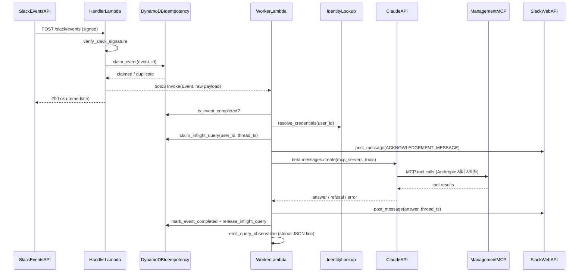
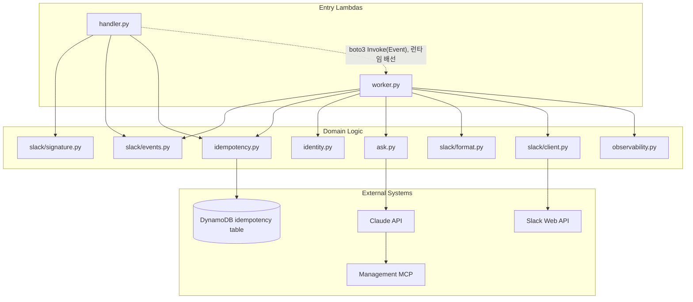
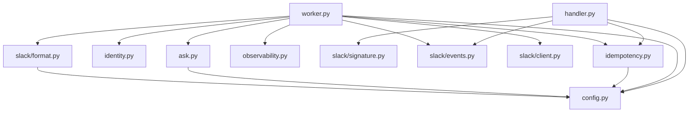

# servers/slackbot 코드 분석

## 분석 목적과 접근

- **목적**: `servers/slackbot`(devoks-mcp-servers uv workspace의 독립 멤버 패키지)을 처음 읽는 개발자가 "Slack 이벤트가 어떻게 들어와서 어떤 경로로 Claude 답변이 되어 돌아가는지"를 handler/worker 두 Lambda 진입점 기준으로 빠르게 파악하도록 돕는 온보딩 문서.
- **접근**: `servers/slackbot/src/devoks_slackbot/` 하위 11개 소스 파일 전문(`config.py`, `handler.py`, `worker.py`, `idempotency.py`, `identity.py`, `ask.py`, `observability.py`, `slack/{signature,events,client,format}.py`)과 `Dockerfile`, `pyproject.toml`을 전부 읽고, import 그래프·모듈 docstring이 명시한 "처리 순서(절대 재배치 금지)" 주석을 따라 실행 시퀀스를 재구성했다. 이어서 `.claude/workspace/slackbot-integration-20260914/{FRD,PLAN}.md`, `docs/slackbot-guide.md`, `docs/RUNBOOK-slackbot.md`로 코드가 어떤 요구사항·계약을 구현한 것인지 대조했다.
- **Spec**: `.claude/workspace/slackbot-integration-20260914/FRD.md`(REQ-SB-001~008, AC-SB-*, CTR-SB-001~009, EDGE-SB-001~020, DSN-SB-001~008)와 `PLAN.md`(TASK-001~036, import 비용 실측, 2026-09-15/16 실환경 실측 기록)를 확인했다. 코드는 이 스펙과 실질적으로 일치하며, FRD 원안이 누락했던 두 항목(`WORKER_FUNCTION_NAME`, `IDEMPOTENCY_TABLE`의 worker 공통화)은 `config.py`/`handler.py`/`worker.py` docstring이 스스로 "이 태스크가 메꾼 config 공백"으로 기록해 두었다 — 아래 서술은 코드 기준(=정정된 계약)이다.
- **테스트**: `servers/slackbot/tests/`에 src와 1:1 대응하는 12개 테스트 파일이 있다 — `test_config.py`(환경변수 파싱), `test_signature.py`(서명 검증, replay/변조), `test_events.py`(payload 파싱·봇 자기메시지), `test_identity.py`(자격 조회·정보 비노출), `test_idempotency.py`(moto 기반 조건부 쓰기 원자성), `test_ask.py`(Claude 오류 분류·MCP 요청 쌍), `test_client.py`(chat.postMessage 오류 분류), `test_format.py`(길이 정책 경계값), `test_observability.py`(레코드 직렬화), `test_handler.py`/`test_worker.py`(ASGI 엔드포인트 동작), `test_handler_isolation.py`(서브프로세스로 `anthropic` import 격리 불변식 검증). `conftest.py`가 `make_handler_settings`/`make_worker_settings` 픽스처 팩토리를 제공한다.
- **관련 문서**: [`docs/slackbot-guide.md`](slackbot-guide.md)(처리 흐름·멱등성·배포 인프라 요약), [`docs/RUNBOOK-slackbot.md`](RUNBOOK-slackbot.md)(2026-09-16 실 Slack 워크스페이스 E2E 실측 5/6 PASS 기록), [`docs/WORKFLOW.md`](WORKFLOW.md), [`README.md`](../README.md)(전체 아키텍처에서 slackbot의 위치), `.claude/rules/project-convention.md`(코딩 규범 SSOT, 본문에는 규범 자체를 옮기지 않고 코드 사실만 서술).
- **비목적**: `servers/management`(별개 패키지, FRD §4.4가 코드 의존 금지를 명시)와 `infra/*.sh` 배포 스크립트 내부 로직은 이번 분석 범위에서 제외했다(존재와 역할만 §6.6/부록 A에서 참조). `servers/slackbot`은 소스 11개 파일·약 2,700줄 규모로 한 번에 읽기 가능한 범위라 하위 모듈로 분할하지 않고 패키지 전체를 단일 범위로 분석했다.

---

## 1. 기능의 정의와 설명

`servers/slackbot`은 Slack Events API와 Claude API의 MCP 커넥터를 잇는 브리지다. Slack 채널에서 봇을 멘션하면, 이미 라이브 중인 Management MCP 서버(`mcp.devoks.kr`)에 자연어로 질의해 답을 스레드에 게시한다. 이 패키지는 MCP 클라이언트를 직접 구현하지 않고 Anthropic 서버 사이드 MCP 커넥터에 그 역할을 위임하며, 3초 ACK 예산(Slack 요구사항)과 수십 초짜리 실제 작업 시간을 분리하기 위해 하나의 컨테이너 이미지에서 ASGI 팩토리 2개(`handler:create_app` / `worker:create_app`)를 노출해 AWS Lambda 2개(`devoks-slack-handler`, `devoks-slack-worker`)로 배포된다.

---

## 2. 디렉토리 구조

```
servers/slackbot/
├── Dockerfile                      # 이미지 1개(arm64+LWA)로 handler/worker 팩토리 2개를 담고, ImageConfig.Command로 Lambda별 분기
├── pyproject.toml                  # 패키지 의존성(starlette/uvicorn/boto3/httpx2/anthropic) — lint/test 설정은 루트가 SSOT
├── src/devoks_slackbot/
│   ├── __init__.py                 # 빈 패키지 마커
│   ├── config.py                   # HandlerSettings/WorkerSettings — 역할별 Fail-Fast 환경변수 파서, Claude 호출 고정값(CLAUDE_MODEL 등)
│   ├── handler.py                  # slack-handler Lambda 진입점 — 서명검증→멱등claim→worker 비동기 dispatch→즉시 200
│   ├── worker.py                   # slack-worker Lambda 진입점 — 자격조회→Claude질의→게시→완료기록→관측로그
│   ├── idempotency.py              # DynamoDB 조건부 쓰기 — event 중복 억제 + in-flight coalescing 락(같은 테이블, prefix만 다름)
│   ├── identity.py                 # Slack user ID → MCP 토큰 조회, 고정 거부 문구(정보 비노출)
│   ├── ask.py                      # Claude API(MCP 커넥터) 호출 — worker 전용, anthropic를 실제로 import하는 유일한 지점
│   ├── observability.py            # 쿼리 1건당 JSON 1줄 관측 레코드(질문 원문 대신 길이+해시)
│   └── slack/
│       ├── __init__.py
│       ├── signature.py            # HMAC-SHA256 서명 검증 — 순수 함수, HTTP/ASGI import 없음
│       ├── events.py               # Slack payload 파싱 — 사용자 식별자 등 추출의 단일 창구, 순수 함수
│       ├── client.py               # chat.postMessage 래퍼 — HTTP 200이어도 body의 ok:false를 실패로 판정
│       └── format.py               # 응답 길이 정책 — 3,500자 상한 + 절단 고지 + grapheme 경계 보호, 순수 함수
└── tests/
    ├── conftest.py                 # make_handler_settings/make_worker_settings 픽스처 팩토리
    └── test_{config,handler,handler_isolation,worker,idempotency,identity,
             ask,observability,signature,events,client,format}.py   # src와 1:1, flat 구조
```

---

## 3. 진입 흐름

이 패키지는 런타임 진입점이 2개다(같은 컨테이너 이미지, `ImageConfig.Command`로 Lambda마다 다른 factory를 지정 — `infra/07-slackbot-lambda.sh` 소관, 코드 밖 배선).

1. **콜드스타트 공통**: Dockerfile `CMD`(기본 handler, worker는 `ImageConfig.Command`가 덮어씀) → `uvicorn devoks_slackbot.<handler|worker>:create_app --factory` → `create_app(settings=None)` 호출 → `load_handler_settings(os.environ)` / `load_worker_settings(os.environ)`가 Fail-Fast로 환경변수를 파싱(실패 시 `ConfigError`, 오류 전부 모아서 raise) → `_configure_logging(log_level)`이 root 로거 레벨 설정 후 `anthropic`/`httpx2` 로거를 INFO 이상으로 재고정(DEBUG 시크릿 유출 방지) → `Starlette(routes=[...])` 반환. AWS Lambda Web Adapter가 `GET /healthz` 2xx 응답을 확인한 뒤에만 트래픽을 넘긴다.
2. **handler Lambda 라우트**: `GET /healthz`(무인증), `POST /slack/events`(API Gateway가 중계하는 Slack 서명 요청).
3. **worker Lambda 라우트**: `GET /healthz`(무인증), `POST /events`(LWA `AWS_LWA_PASS_THROUGH_PATH` — non-HTTP 트리거인 handler의 `boto3` `Invoke(InvocationType="Event")`가 전달한 **원본 미파싱** Slack payload를 그대로 받는 경로. Function URL/API Gateway 라우트가 없고 handler 실행 역할의 `lambda:InvokeFunction`으로만 도달 가능 — worker.py 모듈 docstring이 "신뢰 경계는 서명이 아니라 AWS IAM"이라고 명시).
4. **worker 앱당 1회 초기화**: `anthropic.AsyncAnthropic(api_key=settings.anthropic_api_key)`를 `_make_events_endpoint` 클로저 생성 시 warm-cache — 요청마다 재생성하지 않음.

---

## 4. 실행 시퀀스

### handler 파이프라인(`_slack_events`, 재배치 금지 순서)

```
POST /slack/events
├─ 1. raw_body = await request.body()                          # 파싱 전 원본 bytes 보존
├─ 2. verify_slack_signature(...) == False → 401 (body 파싱 안 함, EDGE-SB-001)
├─ 3. json.loads(raw_body) 실패/비-dict → 400
├─ 4. is_url_verification(payload) == True → 200 {"challenge": ...}   (서명 통과 후에만, EDGE-SB-003)
├─ 5. is_bot_self_message(payload, bot_user_id) == True → 200 "ok" (무처리, EDGE-SB-011)
├─ 6. x-slack-retry-num 헤더 존재 → warning 로그만(값 무관, EDGE-SB-004)
├─ 7. claim_event(event_id) via _claim_or_fail_safe
│     ├─ IdempotencyStoreError → claimed=False, reason="store_error" (fail-safe)
│     └─ claimed=False(duplicate/missing_event_id/store_error) → 200 "ok", dispatch 없음
└─ 8. claimed=True → _dispatch_to_worker(raw_body)  # boto3 Lambda Invoke(Event), 모든 예외 삼킴(로그만)
       → 200 "ok"  (dispatch 성공 여부와 무관하게 항상 200, AC-SB-002-3)
```

### worker 파이프라인(`_process_event`, 재배치 금지 순서)

```
POST /events (LWA pass-through, 원본 Slack payload)
├─ json.loads 실패/비-dict → 200 "ok" (로그만)
└─ _process_event(payload):
   ├─ 1. event_id/user_id/channel/thread_ts/question(멘션 토큰 제거) 추출
   ├─ 2. is_event_completed(event_id) fail-open 체크 == True → return (EDGE-SB-005, 무처리)
   ├─ 3. channel is None → return (게시 불가, 로그만)
   ├─ 4. resolve_credentials(user_id) → granted=False
   │      → _post_and_finish(고정 거부 문구, outcome="denied") → return
   ├─ 5. claim_inflight_query(user_id, thread_ts) fail-open → claimed=False
   │      → _post_and_finish(수신확인만, outcome="denied", reason="coalesced_in_progress") → return
   ├─ try:
   │   ├─ 6. post_message(ACKNOWLEDGEMENT_MESSAGE)         # 실패해도 로그만(_log_post_failure)
   │   ├─ 7. ask_claude(question, mcp_server_url, mcp_token, anthropic_client)
   │   │      ├─ outcome="error"    → _post_and_finish(client_message, outcome="error")
   │   │      ├─ outcome="refused"  → _post_and_finish(client_message, outcome="denied", reason="claude_refusal")
   │   │      └─ outcome="answered" → apply_response_length_policy → _post_and_finish(answer, outcome="ok")
   │   └─ _post_and_finish 공통 꼬리: post_message → mark_event_completed → emit_query_observation
   │        (outcome="ok"인데 게시 자체가 실패하면 관측 기록의 outcome을 "error"로 격하, CTR-SB-008)
   ├─ except Exception: 일반 오류 문구 게시 → mark_event_completed(best-effort) → emit_query_observation(outcome="error")
   └─ finally: release_inflight_query(user_id, thread_ts)   # ⚠️ 어떻게 끝나든 무조건 실행
```

| 관측 `outcome` | 트리거 | `reason_code` 예 |
|---|---|---|
| `ok` | Claude 정상 응답 + Slack 게시 성공 | `None` |
| `denied` | 미등록/미식별 사용자, in-flight coalescing, Claude refusal | `user_unregistered`/`user_unidentified`, `coalesced_in_progress`, `claude_refusal` |
| `error` | Claude API 오류, 게시 실패로 인한 격하, 예상 밖 예외 | `spend_limit_exceeded`/`rate_limited`/`timeout`/… , Slack `reason_code`, `None`(예외 분기는 `error_kind`만) |

### Mermaid: 실행 시퀀스



**사용자 관점 화면 전환**: Slack 스레드에서 `@devoks <질문>` 멘션 → "질문을 확인했습니다..." 접수 메시지 → (수 초~수십 초 후) 같은 스레드에 최종 답변/거부 안내/오류 안내 중 하나가 게시됨.

---

## 5. 주요 비즈니스 로직 및 역할과 책임

### 5.1 역할과 책임

| 단위 | 책임 | 비책임(위임) |
|------|------|----------------|
| `handler.py` | 서명 검증 호출, `url_verification` 응답, 봇 자기메시지 필터, idempotency claim 호출, worker 비동기 dispatch, 무조건 200 | 서명 계산 자체(`slack/signature.py`), payload 해석(`slack/events.py`), Claude/MCP 호출(설계상 금지 — `DSN-SB-008`) |
| `worker.py` | 완료체크·in-flight coalescing·자격조회·`ask_claude` 호출·길이정책 적용·게시·완료기록·관측로그·예외 fallback 오케스트레이션 | 서명 검증(handler가 이미 수행, worker의 신뢰 경계는 AWS IAM), MCP 클라이언트 구현(`ask.py`+Anthropic 인프라) |
| `config.py` | 환경변수 Fail-Fast 파싱, handler/worker 역할별 필수 키 분리, Claude 호출 고정값(SSOT) | 시크릿 저장(SSM), 로깅 레벨 적용(진입점 몫) |
| `idempotency.py` | event claim/완료 기록/in-flight 락의 원자적 DynamoDB 연산(단일 `PARTITION_KEY_ATTR` prefix 재사용) | 실패 시 fail-safe/fail-open 정책 선택(호출자 wrapper 몫), 호출 시점 결정 |
| `identity.py` | `user_id → MCP 토큰` 조회, 고정 거부 문구, 미식별/미등록 정보 비노출 | 토큰 발급/회전, OAuth 전환(Stage 1 §10 트리거 시 이 파일만 교체 예정) |
| `ask.py` | Claude API MCP 커넥터 요청 구성(`mcp_servers`+`tools` 항상 동반), 응답 해석, 오류 분류 | MCP 클라이언트/툴 루프 구현(Anthropic 인프라), 재시도 루프(SDK `max_retries`에 위임) |
| `observability.py` | 쿼리 1건당 JSON 레코드 조립·emit, 질문 해시화(원문 미저장) | 시계 읽기(호출자가 `ts` 제공), 쓰기 실패의 예외 전파(never-raise) |
| `slack/signature.py` | HMAC 서명 계산·상수시간 비교(순수 함수) | HTTP 배선, 헤더 원본 추출 |
| `slack/events.py` | payload 파싱, 사용자 식별자 등 추출의 단일 창구, 봇 자기메시지 판별 | 멘션 토큰 제거(해석은 `worker.py` 몫), 서명 검증 |
| `slack/client.py` | `chat.postMessage` 호출, Slack 오류 분류(`ok:false` 포함) | 재시도 실행(호출자 몫), 메시지 문구 결정 |
| `slack/format.py` | 응답 길이 상한 적용, 절단 고지, grapheme/코드펜스 경계 보호 | 원문(답변) 생성 |
| `Dockerfile`/`infra/07~11-*.sh` | 이미지 1개로 두 factory 노출(패키징) | 실제 Lambda별 배선·환경변수 주입(`infra/07-slackbot-lambda.sh` 소관, 분석 범위 밖) |

### Mermaid: 책임 레이어



### 5.2 예외 처리 (Exception Handling)

| 유형 | 동작 | 비고 |
|------|------|------|
| Slack 서명 불일치 | 401, body는 파싱하지 않음 | `EDGE-SB-001` |
| 서명 통과 후 body가 JSON이 아니거나 비-object | 400 | handler만 해당 |
| idempotency 저장소 장애(`IdempotencyStoreError`) | 지점마다 방향이 다름: handler claim은 **fail-safe**(dispatch 건너뛰고 200), worker 완료체크/in-flight claim은 **fail-open**(진행 허용) | 코드 docstring이 방향을 명시적으로 정당화("응답 불가한 저장소로 정상 질문을 조용히 떨어뜨리지 않는다") |
| worker→handler 비동기 dispatch(boto3 invoke) 실패 | 로그만, 여전히 200 | `AC-SB-002-3`, 의도적으로 넓은 bare `Exception` catch |
| Claude API 오류(4xx/429/5xx/timeout/network) | `ask_claude`가 `AskResult(outcome="error", retryable=..., reason_code=...)`로 정규화 → worker가 `client_message` 게시 | `ask.py` 자체 재시도 루프 없음(SDK `max_retries` 위임) |
| Claude `stop_reason == "refusal"` | 정상 응답 취급, `answer=None`, 거부 안내 게시 | `outcome="refused"` → worker에서 `outcome="denied"`로 관측 |
| Slack 게시 실패(`chat.postMessage`) | `PostMessageResult(ok=False, ...)`로 정규화 — HTTP 200이어도 body `ok:false`면 실패로 판정 | `not_in_channel`/`channel_not_found`는 별도 분류, 나머지는 `slack_error_unknown`(보수적) |
| `outcome="ok"`인데 최종 답변 게시 자체가 실패 | 관측 기록의 `outcome`을 `"error"`로 격하 | `CTR-SB-008` — 도달 안 한 답변이 성공으로 집계되면 안 됨 |
| worker 처리 중 예상 밖 예외 | 고정 일반 오류 문구 게시, 로그(질문/토큰 미노출), `mark_event_completed` 시도, 관측 `outcome="error"` 기록 | `_process_event`의 `except Exception` |
| `release_inflight_query` 자체 실패 | 로그만(더 상위로 전파 불가) | `finally` 블록 안 — 넓은 `except Exception`이 의도적(원 예외를 지우지 않기 위함) |

### 5.3 핵심 알고리즘·규칙

1. **Slack 서명 검증**(`slack/signature.verify_slack_signature`) — `v0:{timestamp}:{raw_body}` → HMAC-SHA256 → 상수시간 비교, 타임스탬프 5분 윈도우 밖이면 서명이 유효해도 거부.
2. **DynamoDB 조건부 쓰기 기반 idempotency**(`idempotency._claim`) — `attribute_not_exists(pk)` 조건부 `PutItem` 단 1회로 원자성 확보. `event#<id>`/`inflight#<user>#<thread_ts>` 두 네임스페이스가 같은 원시 함수를 재사용.
3. **in-flight coalescing**(`claim_inflight_query`/`release_inflight_query`) — 동일 `(user_id, thread_ts)`의 동시 질의를 억제. TTL 360초(`INFLIGHT_TTL_SECONDS_DEFAULT`)가 worker 크래시 시 안전망.
4. **MCP 커넥터 요청 쌍 구성**(`ask._build_mcp_request`) — `mcp_servers`/`tools`를 한 함수에서만 생성해 이름 불일치(`EDGE-SB-009`)를 구조적으로 방지.
5. **Claude 오류 분류**(`ask._classify_status_error`) — HTTP 상태 + 본문 `error.message` prefix/`error.details.error_code`로 재시도 가능 여부(`retryable`)를 판정(지출한도/크레딧소진/rate limit/서버오류/그 외 구분).
6. **응답 길이 정책**(`slack/format.apply_response_length_policy`) — 문자수 상한 + notice 문구 사전 예약 + grapheme 경계 백오프(ZWJ/variation selector/regional indicator) + 코드펜스 짝 맞춤.
7. **멘션 토큰 제거**(`worker._strip_bot_mention`) — `<@BOT_USER_ID>` 정규식 제거는 파싱이 아니라 해석이라 `worker.py`가 담당(`slack/events.py`는 원문 그대로 반환).
8. **SDK 로거 강제 고정**(`_configure_logging`, handler/worker 각자 중복 구현) — `anthropic`/`httpx2` 로거를 root 레벨과 무관하게 INFO 이상으로 고정 — DEBUG 시 SDK가 요청 본문(사람별 MCP 토큰 포함)을 통째로 로깅하는 것을 방지.

### 5.4 입력·출력·부작용

**입력**: Slack Events API POST 본문(JSON, 서명 검증 전 raw bytes) + `X-Slack-Signature`/`X-Slack-Request-Timestamp`/`x-slack-retry-num` 헤더; worker는 handler가 그대로 전달한 동일 raw payload(LWA pass-through); 환경변수(`config.py` 역할별 키 표).

**출력·부작용**: Slack `chat.postMessage` HTTP 호출(스레드 게시), Claude API 호출(`client.beta.messages.create`, 과금 발생), DynamoDB `PutItem`/`UpdateItem`/`GetItem`/`DeleteItem`(idempotency 테이블), `boto3` Lambda `Invoke(InvocationType="Event")`(worker 비동기 기동), stdout JSON 관측 레코드 1줄/쿼리, `logging` 모듈 warning/error 라인(운영자 진단, 시크릿/질문/답변 미포함).

---

## 6. 주요 모듈 및 훅·함수의 프로세스·흐름

### 6.1 Components, Provider·컨텍스트

해당 없음 — React/Provider 트리 개념이 없는 백엔드 ASGI 서비스다. 대신 두 개의 독립된 Starlette 앱 팩토리(`handler.create_app`/`worker.create_app`)가 각자 라우트 세트를 구성하며, 부팅 순서는 §3 참고.

### 6.2 주요 함수·API

| 함수/API | 출처(파일) | 역할 |
|--------|----------------------|------|
| `create_app` | `handler.py` | slack-handler Lambda ASGI factory. `settings` 미지정 시 `os.environ`에서 Fail-Fast 로드 |
| `create_app` | `worker.py` | slack-worker Lambda ASGI factory. `anthropic.AsyncAnthropic` 클라이언트를 앱당 1회 warm-cache 생성 |
| `verify_slack_signature` | `slack/signature.py` | Slack HMAC 서명 검증(순수 함수, `bool` 반환) |
| `is_url_verification`/`is_bot_self_message`/`extract_user_id`/`extract_event_id`/`extract_channel`/`extract_question_text`/`extract_reply_target_ts`/`extract_challenge` | `slack/events.py` | payload 파싱 — 이 패키지 전체가 `payload["event"]["user"]` 등을 직접 읽지 않고 거치는 단일 창구 |
| `resolve_credentials` | `identity.py` | `user_id → MCP 토큰` 조회, 거부 시 고정 문구 |
| `claim_event`/`mark_event_completed`/`is_event_completed` | `idempotency.py` | event 단위 중복 억제(Slack 재시도 + Lambda 비동기 재시도 방어) |
| `claim_inflight_query`/`release_inflight_query` | `idempotency.py` | `(user_id, thread_ts)` 단위 동시 질의 coalescing |
| `ask_claude` | `ask.py` | Claude API MCP 커넥터 호출 + 오류 분류, `AskResult`로 정규화 |
| `post_message` | `slack/client.py` | `chat.postMessage` 래퍼, `PostMessageResult`로 정규화 |
| `apply_response_length_policy` | `slack/format.py` | 응답 길이 상한 적용(3,500자 기본) |
| `build_record`/`to_json_line`/`emit`/`emit_query_observation` | `observability.py` | 관측 레코드 조립·직렬화·기록(never-raise) |

### 6.3 순수 함수·유틸

| 함수/모듈 | 역할 |
|-----------|------|
| `slack/signature.py` 전체 | HTTP/ASGI/SDK import 없음, bytes/str/숫자 → `bool`, 예외 없음(`DSN-SB-007`) |
| `slack/events.py` 전체 | `Mapping`/`str` → `Mapping`/`str`/`None`, 예외 없음(`DSN-SB-007`) |
| `slack/format.py` 전체 | `object`(answer) → `str`, 예외 없음, config 의존은 기본값 참조뿐 |
| `observability.build_record`/`to_json_line` | 순수 직렬화 — I/O 없음, 클록도 호출자가 주입 |

### 6.4 서브프로세스별 흐름 — idempotency 상태 머신(`idempotency.py`)

- **`event#<id>` 네임스페이스**: `(없음)` --`claim_event`(원자적 `PutItem`, `attribute_not_exists`)--> `claimed` --`mark_event_completed`(무조건 `UpdateItem`)--> `completed` --TTL 만료(기본 3,600초, DynamoDB 백그라운드 삭제, 최대 ~48시간 지연 가능)--> `(없음)`
- **`inflight#<user>#<thread_ts>` 네임스페이스**: `(없음)` --`claim_inflight_query`(같은 `_claim` 원시함수 재사용)--> `claimed` --`release_inflight_query`(무조건 `DeleteItem`, `try/finally`로 보장)--> `(없음)`, 또는 --TTL 만료(360초, worker 크래시 안전망)--> `(없음)`

### 6.5 데이터 구조·모델·상수 SSOT

- `HandlerSettings`/`WorkerSettings`, `CLAUDE_MODEL`/`CLAUDE_MAX_TOKENS`/`CLAUDE_EFFORT`/`CLAUDE_MCP_BETA`, `MAX_RESPONSE_CHARS_DEFAULT`(3,500)/`IDEMPOTENCY_TTL_SECONDS_DEFAULT`(3,600) — `config.py`
- `ClaimOutcome`/`ClaimReason`, `InflightClaimOutcome`/`InflightClaimReason`, `PARTITION_KEY_ATTR`/`TTL_ATTRIBUTE`, `INFLIGHT_TTL_SECONDS_DEFAULT`(360) — `idempotency.py`
- `CredentialLookupResult`/`ReasonCode` — `identity.py`
- `AskResult`/`AskOutcome`/`AskReasonCode`, `_REQUEST_TIMEOUT_SECONDS`(60.0) — `ask.py`
- `PostMessageResult`/`PostMessageReasonCode`, `_CHAT_POST_MESSAGE_TIMEOUT_SECONDS`(20.0) — `slack/client.py`
- `ObservationRecord`/`UsageSummary`/`Outcome`(`"ok"|"denied"|"error"`) — `observability.py`

### 6.6 외부에 노출되는 경계

- `POST /slack/events`(handler, API Gateway 라우트) — Slack Events API 공식 계약(`url_verification`/`event_callback`)
- `GET /healthz`(handler·worker 각각) — LWA readiness probe, 무인증
- `POST /events`(worker, LWA pass-through) — HTTP 트리거 아님, handler 실행 역할의 `lambda:InvokeFunction`으로만 도달 가능. worker.py 자체 주석이 "Function URL/API Gateway 라우트/EventBridge·SNS 트리거를 추가하거나 리소스 정책을 완화하지 말 것"이라고 명시(그 순간 서명 없는 사용자 사칭 경로가 열림)
- 외부로 나가는 경계: `chat.postMessage`(Slack Web API), `client.beta.messages.create`(Claude API, MCP 커넥터로 Management MCP 접속), DynamoDB `PutItem`/`UpdateItem`/`GetItem`/`DeleteItem`, `boto3` Lambda `Invoke`

**참고(코드 사실)**: `slack/events.py`의 `is_app_mention_event`는 정의·테스트되어 있으나 `handler.py`/`worker.py` 어디에서도 호출되지 않는다(grep으로 확인) — 실제로 이벤트 타입을 `app_mention`으로 좁히는 지점은 코드가 아니라 Slack App의 이벤트 구독 설정이다.

### 모듈·파일 정적 의존 (import 그래프)

### Mermaid: 정적 의존



**불변식 참고**: `HandlerPy → AskPy`(따라서 `→ anthropic`) import 엣지는 그래프에 존재하지 않는다 — 이것이 `DSN-SB-008`이 요구하는 것이고, `tests/test_handler_isolation.py`가 서브프로세스로 이를 실증한다(실측: `anthropic` import 비용 1,384ms, `CTR-SB-002` 3초 예산의 46%). `HandlerPy`→`WorkerPy` 사이의 화살표는 위 §5 책임 레이어 다이어그램에서 점선으로 표시했듯 Python import가 아니라 런타임 `boto3` Lambda invoke다.

---

## 부록 A. 분석 시 읽을 파일 우선순위

**원칙**: handler/worker 각 모듈 docstring의 "처리 순서(절대 재배치 금지)" 주석을 먼저 읽어 전체 파이프라인을 잡은 뒤, 각 단계가 위임하는 순수 로직 모듈로 내려간다.

| 순위 | 읽을 파일 | 이 단계에서 잡을 포인트 |
|------|-----------|-------------------------|
| P1 | `handler.py`, `worker.py` | 모듈 docstring의 번호 매겨진 처리 순서, `DSN-SB-008`(anthropic import 격리) |
| P2 | `config.py` | `HandlerSettings`/`WorkerSettings` 필수 키 분리, Fail-Fast 오류 수집 패턴 |
| P3 | `idempotency.py` | `_claim`/`_mark_completed`/`_release` 원시 함수와 두 네임스페이스(event#/inflight#) 재사용 구조 |
| P4 | `slack/events.py`, `slack/signature.py` | payload 파싱 단일 창구, 서명 검증 순수 함수 — 입력 신뢰 경계 |
| P5 | `identity.py`, `ask.py` | 자격 조회 정보 비노출 원칙, Claude MCP 커넥터 요청 구성/오류 분류 |
| P6 | `slack/client.py`, `slack/format.py`, `observability.py` | 게시 오류 분류, 응답 길이 정책, 관측 레코드 필드 SSOT(`CTR-SB-008`) |
| P7 | `tests/test_handler_isolation.py`, `tests/test_handler.py` | `DSN-SB-008` 불변식을 서브프로세스로 실증하는 방식, ASGI in-memory 클라이언트로 401/200 경로 검증 |
| P8 | `.claude/workspace/slackbot-integration-20260914/FRD.md` §4~§8, `docs/RUNBOOK-slackbot.md` | 계약(`CTR-SB-*`)·엣지케이스(`EDGE-SB-*`)의 원문, 2026-09-16 실 Slack 워크스페이스 E2E 실측 결과(5/6 PASS, `EDGE-SB-020` 미검증) |
